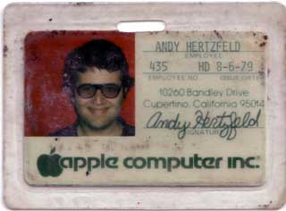

# Things Are Better Than Ever
* Author: Andy Hertzfeld
* Story Date: September 1984
* Topics: Quitting, Personality Clashes, Reality Distortion
* Characters: Andy Hertzfeld, Bob Belleville, Bud Tribble, Steve Jobs, Pat Sharp, Burrell Smith
* Summary: My leave of absence was drawing to a close

 
    
Toward the end of August 1984, my six month leave of absence (see Leave of Absence) was drawing to a close, and I still hadn't decided whether I would return to Apple.  I continued to feel very close to the company, so it wouldn't be easy for me to turn in my badge, but I didn't see a reasonable alternative.

Either way, I was sure that I would continue to write software for the Macintosh, which was still brand new and overflowing with exciting opportunities for innovative applications (see Thunderscan).  I was confident that I could earn more money working independently than Apple was willing to pay me, even if you counted the appreciation of stock options, but financial matters were not my paramount consideration.

The main issue was that I wanted to be able to continue to make a difference in the Mac's evolution and I felt that no matter what I did on my own, it could only have a small fraction of the impact of work done for Apple.  Even though things had gone relatively well so far, the Mac's long term success was far from certain, and it was entirely dependent on the moves that Apple made to evolve the platform.

Many of my closest friends were still working on the Mac team, so I heard a lot about what was going on at Apple.  I usually drove down to Cupertino to visit them once every week or two, hanging out in the Bandley 3 fishbowl (see Spoiled?), tentatively at first, but growing more comfortable when I saw that I was still welcome there.  I lived next door to Mac hardware designer Burrell Smith, in separate houses on the same lot near downtown Palo Alto, so I heard about Burrell's trials and tribulations at work on a daily basis.  Unfortunately, the news wasn't very encouraging.

The Mac team had merged with the Lisa team in Feburary 1984, a few weeks before I started my leave,  creating a single large division.  At the time, Steve Jobs claimed that the merger would help to transform the rest of Apple to be more like the Mac team, but to me it seemed like the opposite had occurred. The idealistic version of the Macintosh team that I yearned for had apparently vanished, subsumed by a large organization of the type that we used to make fun of, riven with bureaucratic obstacles and petty turf wars.  

The core software group was still recovering from the intense effort to ship (see Real Artists Ship) and hadn't done very much all spring and summer, suffering from a classic case of massive post-partum depression.  The LaserWriter printer was the current main focus of development, along with the AppleTalk network required to support it, and the core software team didn't have much to do with either.  No one had set a compelling new goal for the team, and now it was just drifting.

Burrell Smith had completed the LaserWriter digital board and moved on to work on the "Turbo Macintosh", a new Macintosh digital board featuring a custom chip that supported 4-bit/pixel gray scale graphics and a fast DMA channel to interface an internal hard drive.  But Burrell frequently complained of sparring with engineering manager Bob Belleville and others on his staff over trivial design decisions.  He thought that Bob didn't really want to add a hard drive to the Mac, favoring the development of a Xerox style "file server" instead, and was therefore trying to surreptitiously kill the Turbo project.  I didn't think that Burrell would put up with it much longer; as he phrased it, he was "asymptotically approaching liberation" from Apple.
  
The one saving grace was that Bud Tribble had finally completed his six year M.D./Ph.D. program at the University of Washington and decided to forgo practicing medicine in favor of returning to his old job at Apple as Macintosh software manager, working for Bob Belleville.  In July 1984, he moved into a spare bedroom at Burrell's house in Palo Alto, next door to mine, so I got to see him frequently.  I still had the highest respect for Bud, and I loved to show him whatever I was working on because he always managed to improve it with an insightful suggestion or two.

I had mixed feelings about returning to the lumbering Macintosh division, but Bud was a strong link to the good old days and I thought that perhaps we could establish a little outpost in the large organization where the original Macintosh values could prevail.  But that didn't seem possible if Bud worked for Bob Belleville, my nemesis whom I blamed for many of the problems. The only solution I could think of was for Bud to work directly for Steve Jobs instead of working for Bob.  Bud was all for it, but only Steve could make it happen.  I called Steve's secretary Pat Sharp, and arranged to have dinner with Steve and Bud to discuss my possible return to Apple.

We met in the lobby of Bandley 3 and walked to an Italian restaurant on De Anza Boulevard a few blocks away. Steve seemed a bit preoccupied, and I was nervous about how he would react to what I had to say, because I had to implicitly criticize him to make my case.  After we ordered dinner I cleared my throat and tentatively plunged ahead.

"As you know, I care a lot about Apple, and I really want to return from my leave of absence.  I'd love to work for Bud again, but things seem really messed up right now." I paused for a moment as I gathered my resolve.  "The software team is completely demoralized, and has hardly done a thing for months, and Burrell is so frustrated that he won't last to the end of the year..."

Steve cut me off abruptly with a withering stare.  "You don't know what you're talking about!", he interrupted, seeming more amused than angry.  "Things are better than ever. The Macintosh team is doing great, and I'm having the best time of my life right now.  You're just completely out of touch."

I couldn't believe what I was hearing, or tell if Steve was serious or not.  I looked to Bud, who communicated his bewilderment with an apologetic shrug of his shoulders, but I could see that he wasn't going to corroborate my views.

"If you really believe that, I don't think there's any way that I can come back," I replied, my hopes for returning sinking fast.  "The Mac team that I want to come back to doesn't even exist anymore."

"The Mac team had to grow up, and so do you," Steve shot back.  "I want you to come back, but if you don't want to, that's up to you.  You don't matter as much as you think you do, anyway."

I saw that we were so far apart that there was little point in continuing the conversation.  We finished dinner quickly and walked back to Apple without further discussion.

Actually, quitting was easier than I thought it would be; I just called up Apple's HR department and let them know that I wouldn't be coming back.  I didn't even have to sign any paperwork or turn in my badge, which I still have today, almost twenty years later.  I had thought it would feel devastating to finally resign, but instead I actually felt relieved for the situation to be resolved, and optimistic about writing Macintosh software on my own.