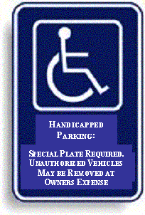

# Handicapped
* Author: Andy Hertzfeld
* Story Date: 1985
* Topics: Personality Clashes, Personality
* Characters: Steve Jobs, Jean-Louis Gassee, Andy Hertzfeld, Steve Wozniak
* Summary: The reason that Steve parks in the handicapped space

 

Most of the anecdotes that I've written for Folklore are based on incidents that I observed myself, but sometimes a second or third hand story is just too good to pass up.  I have to issue a disclaimer here that I didn't actually witness the punch line to this one, and it certainly seems too good to be true.
    
Steve Jobs was not the most considerate individual at Apple, and he had lots of ways to demonstrate that.  One of the most obvious was his habit of parking in the handicapped spot of the parking lot - he seemed to think that the blue wheelchair symbol meant that the spot was reserved for the chairman.

Whenever you saw a big Mercedes parked in a handicapped space, you could be sure that it was Steve's car (actually, it was hard to be sure otherwise, since he also had a habit of removing his license plates).  This sometimes caused him trouble, since unknown parties would occasionally retaliate by scratching the car with their keys.

Anyway, the story is that one day Apple executive Jean-Louis Gassee, who had recently transferred to Cupertino from Paris, had just parked his car and was walking toward the entrance of the main office at Apple when Steve buzzed by him in his silver Mercedes and pulled into the handicapped space near the front of the building.

As Steve walked brusquely past him, Jean-Louis was heard to declare, to no one in particular - "Oh, I never realized that those spaces were for the emotionally handicapped...".

One day in October 1983 I got a phone call at my desk at Apple from the Cupertino police department saying something like, "You reported that Mercedes parked in the handicapped space at your lot at Apple. Well, we sent a car out there but we can't really tow it away because the handicapped space is improperly designated."

I had no idea what he was talking about.  A few hours later, I found out that Apple's other cofounder, Steve Wozniak, who was a prolific prankster, called up the Cupertino police and reported that a silver Mercedes was illegally parked in a handicapped space and told them the person reporting it was Andy Hertzfeld, giving them my phone number at work.   I decided not to inform Apple's facilities department about the improperly marked space, just in case Woz decided to try it again.