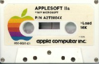

# MacBasic
* Author: Andy Hertzfeld
* Story Date: June 1985
* Topics: Software Design, Management
* Characters: Donn Denman, Bryan Stearns, Jerome Coonen, Randy Wigginton, John Sculley, Bill Gates, Bill Atkinson, Steve Wozniak
* Summary: The sad story of MacBasic

 

When the Apple II was first introduced in April 1977, it couldn't do very much because there were few applications written for it. It was important to include some kind of programming language, so users, who were mostly hobbyists, could write their own programs. "Basic", which was designed for teaching introductory programming by two Dartmouth professors in the 1960s, became the language of choice for early microcomputers because it was interactive, simple and easy to use. The Apple II included a Basic interpreter known as "Integer Basic", written from scratch by Steve Wozniak, which was almost as idiosyncratically brilliant as his hardware design, stored in 5K bytes of ROM on the motherboard.  It also came with Microsoft's Basic interpreter, dubbed "Applesoft Basic", on cassette tape.  Sadly, Applesoft eventually displaced Integer Basic in ROM in the Apple II Plus because it had the floating point math routines that Woz never got around to finishing.

Donn Denman started working at Apple around the same time that I did, in the summer of 1979.  His job was to work with Randy Wiggington on porting Applesoft Basic to the Apple III.  They needed to rewrite parts of it to deal with the Apple III's  tricky segmented memory addressing, as well as porting it to SOS, the new operating system designed for the Apple III.  It was easy for me to track Donn's steady progress because he sat in the cubicle across from mine when we moved into Bandley III in the spring of 1980.

By the summer of 1981, the Macintosh project was beginning to hit its stride, and we started thinking about the applications that we wanted to have at launch to show off the unique character of the Macintosh.  Besides a word processor and a drawing program, we thought that a Basic interpreter would be important, to allow users to write their own programs. We decided we should write it ourselves, instead of relying on a third party, because it was important for the Basic programs to be able to take advantage of the Macintosh UI, and we didn't trust a third party to "get it" enough to do it right.

I still had lunch with some of my friends in the Apple II group a couple of times a week, and I started trying to convince Donn to join the Mac team to implement our Basic.  He was reluctant at first, since the Mac project was still small and risky, but he was pretty much finished with Apple III Basic and was full of ideas about how to do it better. He eventually couldn't resist and joined the Mac team in September 1981.

A Basic interpreter consists of a text editor for inputing your program, a parser to translate it into a series of byte codes, and an interpreter to execute the byte-coded instructions.  Donn wrote the interpreter first, and then hand-coded some byte codes to test it.  He implemented some graphics primitives early on, since they were nice to demo. In a few months, he had a pretty impressive demonstration program going that drew elaborate graphical trees recursively, in multiple windows simultaneously, showing off the interpreter's threading capabilities.

By the spring of 1982, it was apparent that Donn needed some help if we wanted Basic ready for the introduction, which at the time was supposed to be in January 1983.  We decided to hire Bryan Stearns to help him, who Donn knew from the Apple II team. Bryan was only 18 years old, but he was excited about the project and Donn thought they worked well together, so we gave him a chance.

But Basic still had a hard time getting traction, especially since the system was evolving rapidly beneath it.  After six months or so, I was surprised to hear that Bryan was quitting the project to work at a tiny start-up founded by Chuck Mauro, who I had helped with his 80 column card for the Apple II.  I tried to talk him out of it but he left anyway.  By the spring of 1983, it was so obvious that Basic wouldn't be ready for the introduction that the software manager, Jerome Coonen, pulled Donn off of it to work on other parts of the ROM and the system.  Donn worked on desk accessories and wrote the alarm clock and notepad, as well as the math guts of the calculator (see Desk Ornaments).

After the Mac shipped in January 1984, Donn went back to work on Basic with renewed vigor, determined to get it finished.  Apple brought in some free-lance writers to write books about it (including Scot Kamins, who was a co-founder of the first Apple users group in the Bay Area).  But Microsoft surprised us, and released a Basic for the Macintosh that they didn't tell us they were developing.  It was everything that we expected and feared, since it was essentially console-based - it didn't really use the Mac user interface.  Donn was making good progress and looked to be on track to ship in early 1985; we were excited to show the world what Basic should really look like on the Macintosh.

Unfortunately, there was another problem on the horizon.  Apple's original deal with Microsoft for licensing Applesoft Basic had a term of eight years, and it was due to expire in September 1985.  Apple still depended on the Apple II for the lion's share of its revenues, and it would be difficult to replace Microsoft Basic without fragmenting the software base.  Bill Gates had Apple in a tight squeeze, and, in an early display of his ruthless business acumen, he exploited it to the hilt.  He knew that Donn's Basic was way ahead of Microsoft's, so, as a condition for agreeing to renew Applesoft, he demanded that Apple abandon MacBasic, buying it from Apple for the price of $1, and then burying it.  He also used the renewal of Applesoft, which would be obsolete in just a year or two as the Mac displaced the Apple II, to get a perpetual license to the Macintosh user interface, in what probably was the single worst deal in Apple's history, executed by John Sculley in November 1985.

When Donn found out that MacBasic had been cancelled, he was heart-broken.  His manager told him "it's been put on hold indefinitely" and instructed him to destroy the source code and all copies, but refused to answer Donn's questions about what was going on.  Later that day Donn went for a wild ride on his motor cycle and crashed it, returning home scraped up but with no real damage, except to his already battered ego.  

Bill Atkinson was outraged that Apple could treat Donn and his users so callously, and let John Sculley know how he felt, but the deal was done and couldn't be reversed. 

Donn quickly filed for a leave of absence, but eventually returned to Apple to work on various projects, including AppleScript.  

The Beta version of MacBASIC had been released to interested parties, including Dartmouth University which used it in an introductory programming class.  Apple tried to get back all the copies, but the Beta version was widely pirated, and two books on MacBASIC were published, and sold quite well for several years.