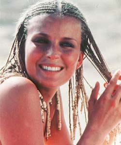

# An Early 'Switch' Campaign
* Author: Tom Zito
* Story Date: September 1985
* Topics: Personality, Celebrities
* Characters: Bo Derek, Steve Jobs
* Summary: Steve Jobs tries to get Bo Derek to abandon her PC in favor of a Mac

 

My former wife, Laura Bachko, had been a book editor in New York and had worked on a project with Bo Derek before we moved to California.  One night when Laura and I were having dinner with Steve, Bo's name came up -- as did the factoid that Bo was a heavy duty computer jockey, albeit of the IBM persuasion.  Steve took this as a personal challenge; he was going convert Bo to a Mac user -- and who knew what else.  Clearly the computer could be a foot in the door.  He persuaded Laura to make him an appointment with Bo.

And so one day shortly thereafter, Steve piled into his Mercedes, along with a Mac, and drove down to Bo's Santa Barbara ranch, which she shared with her husband John Derek.  Bo was cordial but unimpressed; she accepted the computer but remained a PC user.  And apparently she did not find Steve as dashing as Steve expected she would.

Several weeks later, Steve was complaining to Laura about the lackluster impression he had made.  "Look," she told him.  "She's married. And besides, I don't know any woman who would want her name to be Bo Jobs."