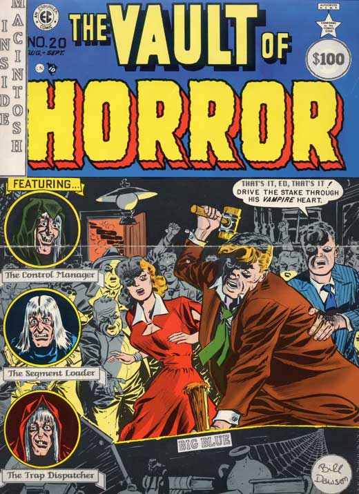
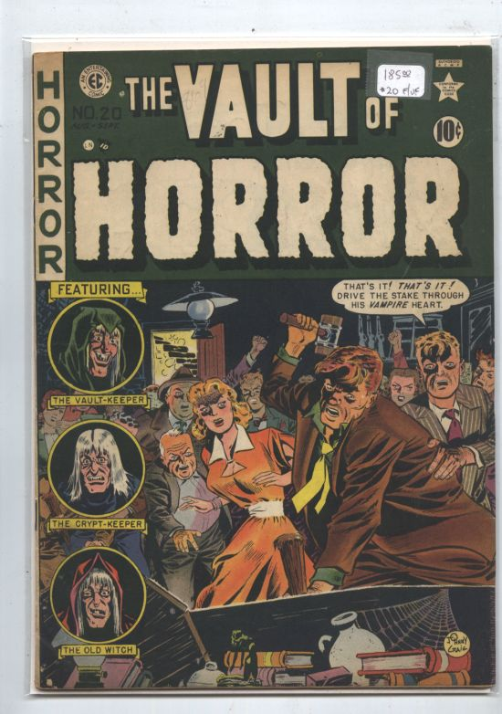

# Vault of Horror
* Author: Caroline Rose
* Story Date: October 1985
* Topics: Documentation
* Characters: Caroline Rose, Bill Dawson, Scott Knaster, Chris Espinosa
* Summary: The Inside Mac cover you never saw

 

Scott Knaster, who was in Apple's developer tech support group when I was working on Inside Macintosh (the Mac developer documentation), has a great sense of humor and is a comic book fan. So it was no big surprise when, shortly before the publication of the combined hardcover edition of Volumes I through III in November 1985, he gave the Inside Mac team a "proposed cover" for that edition that was based on the cover of an old comic book called the Vault of Horror. Scott had given a reprint of issue 20 of this comic (originally published in 1951) to Bill Dawson in Apple's production group and asked him to alter it in certain ways to make it apply to Inside Mac. Bill did this by cutting and pasting with scissors and glue, because in those days there were no other options, like scanning it in and doctoring it in Photoshop. I've included the original along with the doctored version in this story, so you can compare.

We cracked up at the parts of the Macintosh Toolbox Scott chose as the names of the three evil-looking characters stacked up on the left: the Control Manager, the Segment Loader, and the Trap Dispatcher. The coffin containing the vampire whose heart is having a stake driven through it was labeled "BIG BLUE" to show how Apple was going to wipe out IBM with the success of the Mac. More subtle was the change made to what's being said to the man driving the stake: he's addressed as "Ed" because the group we were in was called User Ed (short for User Education). And in case the $100 price Bill added looks like a joke: it wasn't; it was an educated guess at what the humongous hardcover edition would cost (which ended up at $79.95).

An easily overlooked change appears in the upper left, in the "EC" logo: where it said "Entertaining Comics," Bill changed it to "Espinosa Comics," reflecting Chris Espinosa's role as the manager of User Ed.

Apple of course didn't use this cover, but six years later, during my stint as editor in chief of *develop,* Apple's technical journal for Mac developers, I thought it would be fun to reprint the cover in an issue of *develop.* From the reverse of the cover I saw that the original comic was published by William M. Gaines, whose name I was familiar with as the eccentric publisher of MAD magazine. Gaines had been a hero of mine since childhood; in fact, I billed myself as the "editor in cheek" of *develop* and gave the journal as playful and irreverent a tone as I could get away with. So I contacted his office in New York and asked for permission to publish the altered cover. A few weeks later I received a call from someone who, in a tone that was more morose than professional, said he was William Gaines and was granting me the permission I requested. That the man himself should call me was quite a surprise and a thrill-and I'm glad he didn't procrastinate, because he died not much later (in June 1992).

It turns out that there were people at Apple who objected to publishing the cover in *develop.* I think that by then they thought driving a stake (however metaphorical) through IBM's heart would be impolitic. I'm happy that now I finally have a chance to show it to a wider audience.