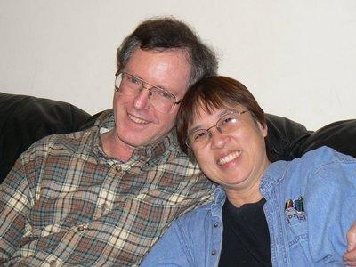

# Eulogy for Brian
* Author: Andy Hertzfeld
* Story Date: February 2010
* Topics: Apple Spirit, Eulogy
* Characters: Brian Howard, Jef Raskin, Burrell Smith
* Summary: Eulogy for Brian Howard, Macintosh hero, 1944-2010

 
    
Brian Howard was the second person to join the Mac team, and played a crucial role at Apple co-designing many generations of Macs for over thirty years.   When he passed away from cancer on February 1, 2010, his wife Lynne asked me to speak about his contributions to Apple at his memorial service; I'm including my notes for the talk below.

* * * * *

Brian was not only one of the nicest people I've ever known, he was also one of the most modest, so I hope that he wouldn't be too upset with me for bragging about the enormous contributions that he made to Apple and the Macintosh team, and through them, to the computer industry and many millions of users.

Brian joined Apple in January 1978, along with his best friend and collaborator, Jef Raskin, as employee number 32, when it was still a tiny startup .  Brian and Jef had formed a two-person technical consulting company called Bannister and Crun, where they got a contract in 1977 to write Apple's very first manual for Integer Basic.  They did such a great job on it that they were offered full-time jobs to co-found Apple's publications department, where they assembled a remarkable team of terrific writers with a playful, rebellious spirit that helped forge and exemplify the unique personality of Apple.

In early 1979, Jef starting writing a series of papers describing his vision for the personal computer as an information appliance - computers that were extremely inexpensive and easy to use, that could potentially sell by the millions.  Brian was his main sounding board, helping Jef to refine his ideas and often working out various technical details to support them.  When Jef got permission to form a small team to pursue developing his ideas, Brian was the first one to join it.  For a while, the Mac team was just Jef and Brian.

The project really took off when Jef hired Burrell Smith, who came up with an amazing hardware design that breathed life into Jef's vision, eventually attracting Apple co-founder Steve Jobs to the project. But Jef and Steve had an epic personality clash, even though their sensibilities were quite similar in many ways, but it soon became clear that they couldn't work together.  When Jef left the project, there was enormous pressure on Brian to leave with him - if he did, it could have swayed Burrell to leave as well, which would have been the end of the project as we know it.

Brian was very close to Jef, and I'm sure it was painful to explain that he thought it was the right thing to stay at Apple, since that would give their shared goal a much better chance of happening.  It wasn't easy, but Brian's pragmatic level-headedness held the team together during this critical transition - there probably wouldn't be a Macintosh or Apple today if it wasn't for Brian doing the right thing at a considerable personal cost.

Burrell was another eccentric genius, probably even more difficult than Jef, with little patience and tolerance for the demands of the organization.  Brian's even-tempered, sweet nature, along with his superb intellect and technical writing skills made him the perfect foil for Burrell.  Brian became the conduit through which Burrell's brilliant design connected with the rest of Apple, through Brian's meticulous documentation and infinite patience at explaining Burrell's crazy techniques to the rest of the company.

Brian often stayed late at Apple helping Burrell to overcome whatever obstacle was in front of them, from double and triple checking the PC board traces before sending it out to layout to isolating and fixing various problems with the timings. Burrell could get hot-headed when stressed, but Brian's cool, calm nature made him the perfect partner for Burrell.  Burrell called him "Uncle Dougie", which was a term of respect, I think, acknowledging his maturity and dependable steadfastness.

It was also Brian's idea to defy management and route extra memory address lines on the final PC boards, enabling a simple modification to quadruple the memory to 512K, allowing our early customers to extend the useful life of their machines without having to buy a whole new one.

And Brian remained at Apple after most of the original team left, teaming up with Bob Bailey to design many of the very best Macintoshes over the years - in fact, whenever there was a particularly good one, you could bet it was designed by Bob and Brian. I think he was Apple's longest continuous employee, working there for over 30 years.

Brian was always kind and helpful to everyone he encountered, no matter how stressful the circumstance.  His personality made him the perfect partner for creative geniuses like Jef, Burrell and Steve.  He worked with grace, humor, formidable intelligence and pragmatic wisdom.  He was one of the finest people I've ever known and I will miss him terribly.