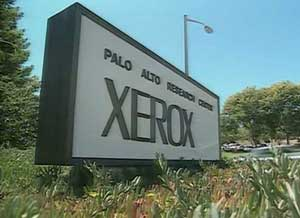

# On Xerox, Apple and Progress
* Author: Bruce Horn
* Story Date: undated
* Topics: Credit, Software Design, Origins
* Characters: Bruce Horn, Bill Atkinson, Larry Tesler, Steve Jobs, Jerry Manock
* Summary: An essay discussing where the Mac user interface came from

This essay was written by Bruce in 1996, and is reprinted here with his permission.  Bruce was one of the main designers of the Macintosh software, and he worked at Xerox for years before that, so he's uniquely qualified to discuss their relationship.

* * *

## Where It All Began

For more than a decade now, I've listened to the debate about where the Macintosh user interface came from. Most people assume it came directly from Xerox, after Steve Jobs went to visit Xerox PARC (Palo Alto Research Center). This "fact" is reported over and over, by people who don't know better (and also by people who should!). Unfortunately, it just isn't true - there are some similarities between the Apple interface and the various interfaces on Xerox systems, but the differences are substantial.

Steve did see Smalltalk when he visited PARC. He saw the Smalltalk integrated programming environment, with the mouse selecting text, pop-up menus, windows, and so on. The Lisa group at Apple built a system based on their own ideas combined with what they could remember from the Smalltalk demo, and the Mac folks built yet another system. There is a significant difference between using the Mac and Smalltalk.

Smalltalk has no Finder, and no need for one, really. Drag-and- drop file manipulation came from the Mac group, along with many other unique concepts: resources and dual-fork files for storing layout and international information apart from code; definition procedures; drag-and-drop system extension and configuration; types and creators for files; direct manipulation editing of document, disk, and application names; redundant typed data for the clipboard; multiple views of the file system; desk accessories; and control panels, among others. The Lisa group invented some fundamental concepts as well: pull down menus, the imaging and windowing models based on QuickDraw, the clipboard, and cleanly internationalizable software.

Smalltalk had a three-button mouse and pop-up menus, in contrast to the Mac's menu bar and one-button mouse. Smalltalk didn't even have self-repairing windows - you had to click in them to get them to repaint, and programs couldn't draw into partially obscured windows. Bill Atkinson did not know this, so he invented regions as the basis of QuickDraw and the Window Manager so that he could quickly draw in covered windows and repaint portions of windows brought to the front. One Macintosh feature identical to a Smalltalk feature is selection-based modeless text editing with cut and paste, which was created by Larry Tesler for his Gypsy editor at PARC.

As you may be gathering, the difference between the Xerox system architectures and Macintosh architecture is huge; much bigger than the difference between the Mac and Windows. It's not surprising, since Microsoft saw quite a bit of the Macintosh design (API's,sample code, etc.) during the Mac's development from 1981 to 1984; the intention was to help them write applications for the Mac, and it also gave their system designers a template from which to design Windows. In contrast, the Mac and Lisa designers had to invent their own architectures. Of course, there were some ex- Xerox people in the Lisa and Mac groups, but the design point for these machines was so different that we didn't leverage our knowledge of the Xerox systems as much as some people think.

The hardware itself was an amazing step forward as well. It offered an all-in-one design, four-voice sound, small footprint, clock, auto-eject floppies, serial ports, and so on. The small, portable, appealing case was a serious departure from the ugly- box-on-an-ugly-box PC world, thanks to Jerry Manock and his crew. Even the packaging showed amazing creativity and passion - do any of you remember unpacking an original 128K Mac? The Mac, the unpacking instructions, the profusely-illustrated and beautifully- written manuals, and the animated practice program with audio cassette were tastefully packaged in a cardboard box with Picasso- style graphics on the side.

## Looking Back

In my opinion, the software architectures developed at Xerox for Smalltalk and the Xerox Star were significantly more advanced than either the Mac or Windows. The Star was a tremendous accomplishment, with features that current systems haven't even started to implement, though I see OpenDoc as a strong advance past the Xerox systems. I have great respect for the amazing computer scientists at Xerox PARC, who led the way with innovations we all take for granted now, and from whom I learned a tremendous amount about software design.

Apple could have developed a more complex, sophisticated system rivaling the Xerox architectures. But the Mac had to ship, and it had to be relatively inexpensive - we couldn't afford the time or expense of the "best possible" design. As a "little brother" to the Lisa, the Macintosh didn't have multitasking or protection - we didn't have space for the extra code or stack required. The original Macintosh had extremely tight memory and disk constraints; for example, the Resource Manager took up less than 3,000 bytes of code in the ROM, and the Finder was only 46K on disk. We made \_many\_ design decisions that we regretted to some extent - even at the time some of us felt disappointed at the compromises we had to make - but if we had done it differently, would we have shipped at all?

## The Past and Future

In many ways, the computing world has made remarkably small advances since 1976, and we continually reinvent the wheel. Smalltalk had a nice bytecoded multi-platform virtual machine long before Java. Object oriented programming is the hot thing now, and it's almost 30 years old (see the Simula-67 language). Environments have not progressed much either: I feel the Smalltalk environments from the late 1970's are the most pleasant, cleanest, fastest, and smoothest programming environments I have ever used. Although CodeWarrior is reasonably good for C++ development, I haven't seen anything that compares favorably to the Smalltalk systems I used almost 20 years ago. The Smalltalk systems of today aren't as clean, easy to use, or well- designed as the originals, in my opinion.

We are not even \_close\_ to the ultimate computing-information- communication device. We have much more work to do on system architectures and user interfaces. In particular, user interface design must be driven by deep architectural issues and not just new graphical appearances; interfaces are structure, not image. Neither Copland nor Windows 95 (nor NT, for that matter) represent the last word on operating systems. Unfortunately, market forces are slowing the development of the next revolution. Still, I think you can count on Apple being the company bringing these improvements to next generation systems.

I'm sure some things I remember as having originated at Apple were independently developed elsewhere. But the Mac brought them to the world.