# Busy Being Born
* Author: Andy Hertzfeld
* Story Date: undated
* Topics: Origins, User Interface, Early Programs, Lisa, QuickDraw, Software Design
* Characters: Bill Atkinson, Bud Tribble, Steve Jobs
* Summary: A visual history of the development of the Lisa/Macintosh user interface

The Macintosh User Interface wasn't designed all at once; it was actually the result of almost five years of experimentation and development at Apple, starting with graphics routines that Bill Atkinson began writing for Lisa in late 1978.  Like any evolutionary process, there were lots of false starts and blind alleys along the way.  It's a shame that these tend to be lost to history, since there is a lot that we can learn from them.

Fortunately, the main developer of the user interface, Bill Atkinson, was an avid, lifelong photographer, and he had the foresight to document the incremental development of the Lisa User Interface (which more or less became the Mac UI after a few tweaks) with a series of photographs.  He kept a Polaroid camera by his computer, and took a snapshot each time the user interface reached a new milestone, which he collected in a loose-leaf notebook.   I'm excited to be able to reproduce and annotate them here, since they offer a fascinating, behind the scenes glimpse of how the Mac's breakthrough user interface was crafted.

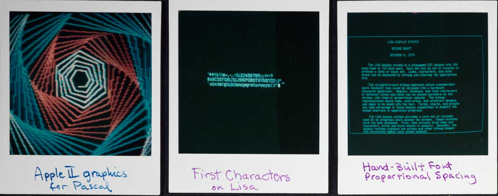

The first picture in Bill's notebook is from Bill's previous project, just before starting work on the Lisa: Apple II Pascal.  The high performance graphics routines that Bill wrote for Apple II Pascal in the fall of 1978 led right into his initial work on the Lisa.

The center and right photos, from the spring of 1979, were rendered on the actual Lisa Display system, featuring the 720 by 360 resolution that remained constant all the way through to the shipping product.  No Lisa existed yet;  these were done on a wired wrapped prototype card for the Apple II.   The middle picture shows the very first characters ever displayed on a Lisa screen; note the variable-width characters.  The rightmost picture has more proportional text, about the Lisa display system, rendered in a font that Bill designed by hand.

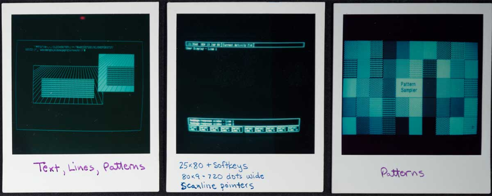

The leftmost picture illustrates the first graphics primitives that Bill wrote for LisaGraf (which was eventually renamed to QuickDraw in 1982) in the spring of 1979, rendering lines and rectangles filled with 8x8 one-bit patterns.  The power and flexibility of the patterns are illustrated in the rightmost shot, which were our poor man's substitute for color, which was too expensive (at the required resolution) in the early eighties.

The middle picture depicts the initial user interface of the Lisa, based on a row of "soft-keys", drawn at the bottom of the screen, that would change as a user performed a task.  These were inspired from work done at HP, where some of the early Lisa designers hailed from.

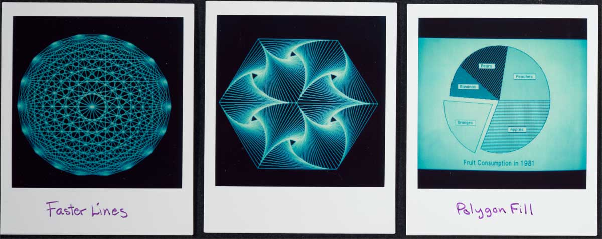

Here are some more demos of the initial graphics routines.  Bill made line-drawing blindingly fast with an algorithm that plotted "slabs" of multiple pixels in a single memory access.  The rightmost picture shows how non-rectangular areas could be filled with patterns, too.

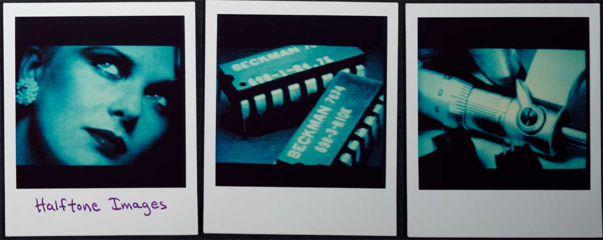

Here are some scanned images, showing off Lisa's impressive resolution for the time, which Bill scanned using a modified fax machine.  He was always tweaking the half-toning algorithm, which mapped gray scales into patterns of monochrome dots.  Bill had made versions of these for the Apple II that Apple distributed on demo disks, but these higher resolution Lisa versions were much more impressive.

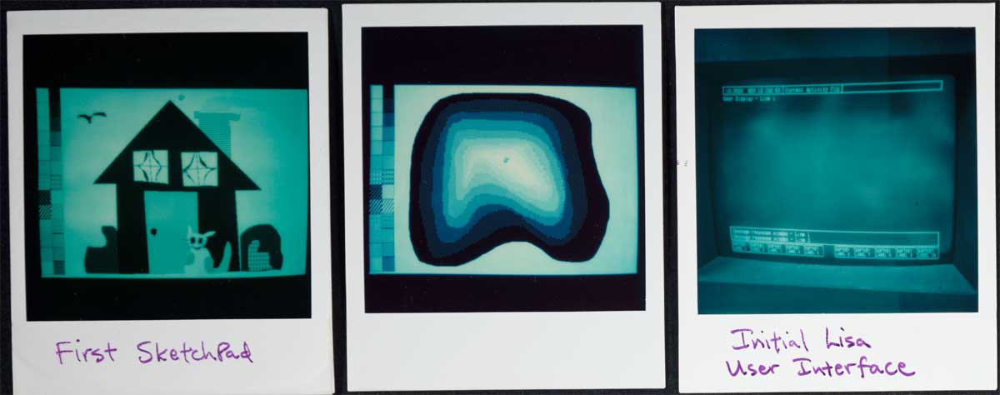

The left and middle pictures show off the first sketch program, an early ancestor of MacPaint, that allowed mouse-based drawing with patterns and a variety of brush shapes.  I think these are perhaps a bit out of sequence, done in early 1980.   The rightmost picture shows the final soft-key based UI, which is about to change radically...

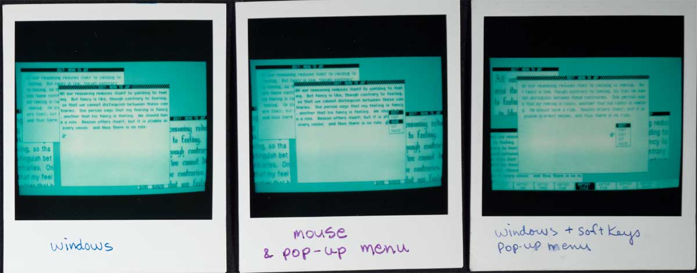

...into a mouse/windows based user interface.   This is obviously the biggest single jump in the entire set of photographs, and the place where I most wish that Bill had dated them.   It's tempting to say that the change was caused by the famous Xerox PARC visit, which took place in mid-December 1979, but Bill thinks that the windows predated that, although he can't say for sure.

The leftmost picture shows different fonts in overlapping windows, but we didn't have a window manager yet, so they couldn't be dragged around.  The middle window shows the first pop-up menu, which looks just like SmallTalk, as does the simple, black title bar.  The rightmost picture shows that we hadn't given up on the soft-keys yet.

By now, it's the spring of 1980 and things are starting to happen fast.   The leftmost picture shows the earliest text selection, using a different highlighting technique than we ended up with.  It also shows a "command bar" at the bottom of the screen, and that we had started to use non-modal commands (make a selection, then perform an action, instead of the other way around).

The middle picture shows the very first scroll bar, on the left instead of the right, before the arrow scroll buttons were added.  It also has a folder-tab style title bar, which would persist for a while before being dropped (Bill says that at that point, he was confusing documents and folders).  The right most photo shows that we adopted the inverse selection method of text highlighting.

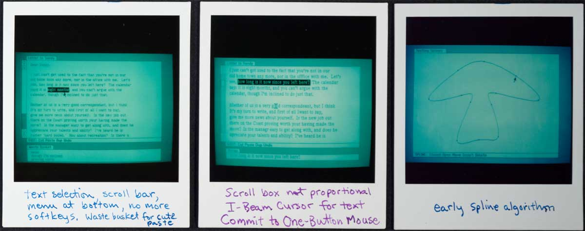

By the summer of 1980, we had dropped the soft-keys.  The leftmost photo shows that we had mouse-based text editing going, complete with the first appearance of the clipboard, which at that point was called "the wastebasket".  Later, it was called the "scrap" before we finally settled on "clipboard."  There was also a Smalltalk style scrollbar, with the scroll box proportional to the size of the document.  Note there are also two set of arrows, since a single scrollbar weirdly controlled both horizontal and vertical scrolling.

The next picture shows that we dropped the proportional scroll box for a simpler, fixed-size one, since we were afraid users wouldn't understand the proportionality.  It also shows the I-Beam text cursor for the first time.  At this point, we were finally committed to the one-button mouse, after a long, protracted internal debate.

The right most picture shows Bill playing around with splines, which are curves defined by a few draggable control points.  QuickDraw didn't end up using splines, but the picture is still notable for the first appearance of the "knobbie" (a small, draggable, rectangular affordance for a point).

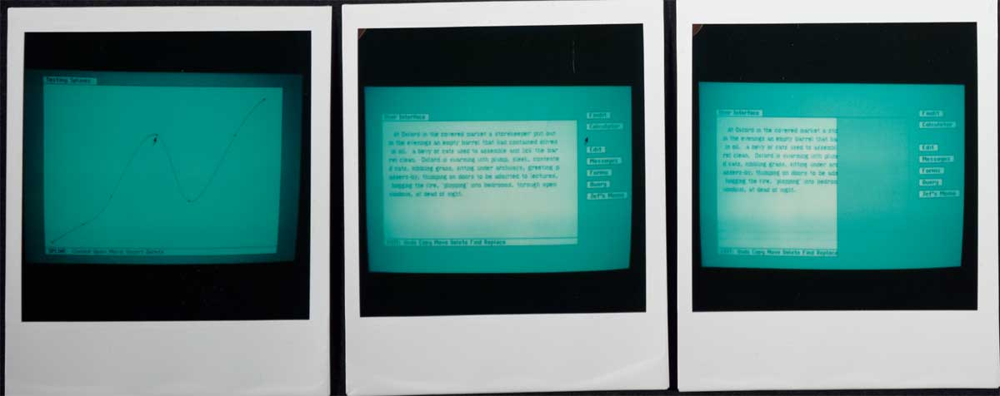

By now, it's the fall of 1980.  The middle picture shows us experimenting with opened and closed windows, which was eventually dropped (but it made a comeback in the 1990s and is in most systems today one way or another).  The right most picture shows the first window resizing, by dragging a gray outline, although it's not clear how resizing was initiated.

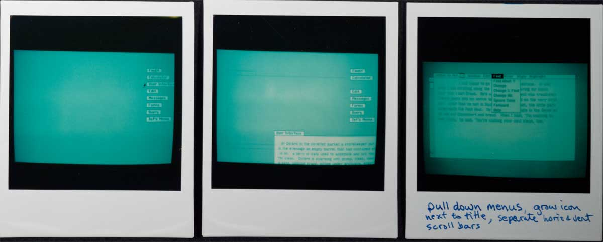

The middle picture shows that windows can be repositioned by dragging a gray outline.   We wanted to drag the whole window, like modern user interfaces do today, but the processors weren't fast enough in those days.  As far as I know, the NeXTStep was the first system to do it the modern way.

The right most picture shows the first appearance of pull-down menus, with a menu bar at the top of the window instead of the top of the screen, which is the way Windows still does things.   By this point, we also gave up on using a single scroll bar for both horizontal and vertical scrolling; it's looking very much like what the Mac shipped with in 1984 now.

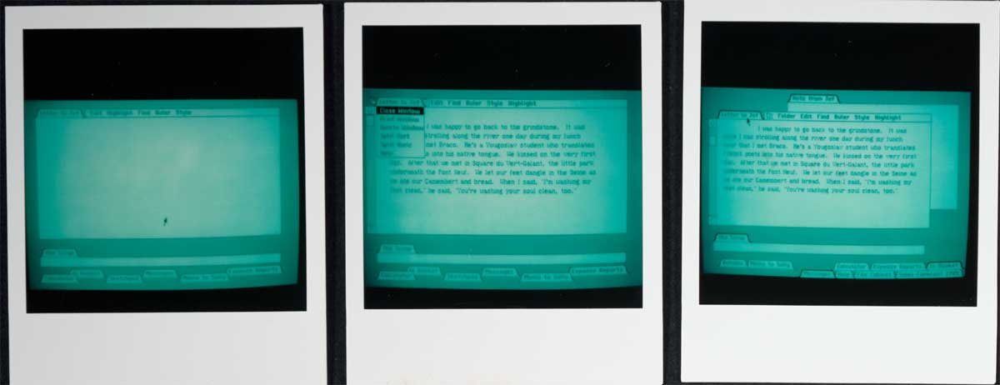

This set of pictures illustrates the Lisa desktop, circa the end of 1980, with a tab-shaped title, followed by a menu bar attached to the window.  Windows could be reduced to tabs on the desktop.   We've also changed the name of the clipboard to "the scrap", an old typesetting term.

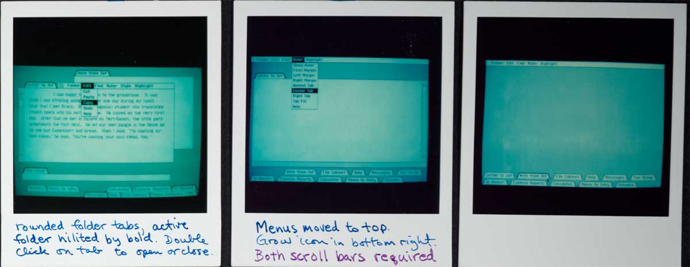

The leftmost picture mentions the first use of double-click, to open and close windows.  The middle picture represents a real breakthrough, by putting the menu bar at the top of the screen instead of the top of each window.  The menu bar contains the menus of the "active folder", which is the topmost window.  By this point, the grow icon found its way to the bottom right, at the intersection of the horizontal and vertical scrollbars, which stuck.   This is the first picture which is really recognizable as the shipping Macintosh.

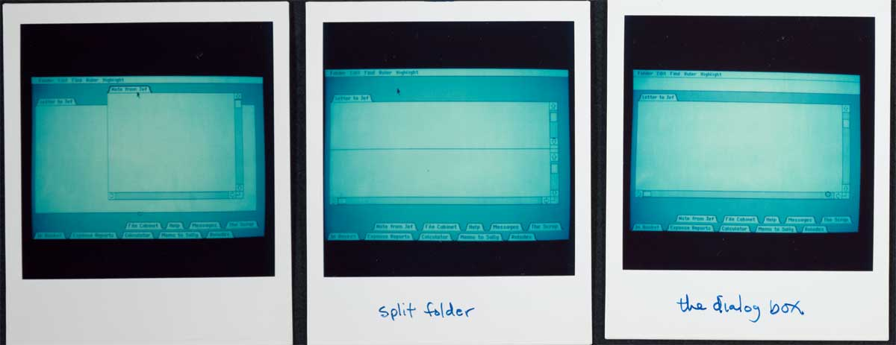

By now, it's early 1981, and things are beginning to shape up.  The leftmost picture shows a window with scrollbars that look a lot like the ones that shipped.   The middle folder illustrates split views, which were used by Lisa's spreadsheet application.   The rightmost picture contains the first appearance of a dialog box, which at the time ran the entire length of the screen, just below the menu bar.

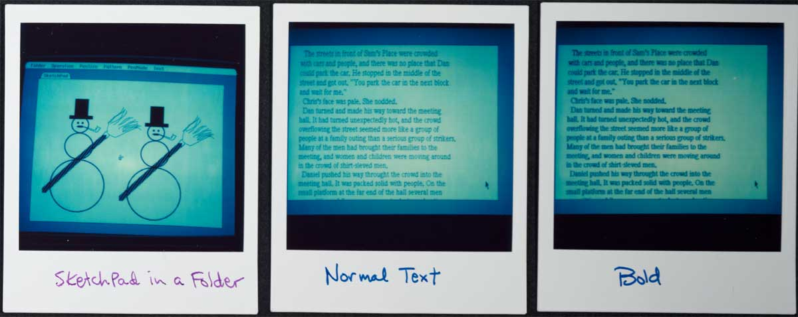

Now that the basic window structure was stabilizing, Bill turned his attention back to the graphics routines.   He worked more on the Sketch program (the forerunner of MacPaint); the snowman drawing on the left is a clue that it's now Winter 1981.   He added algorithmic text styles to the graphics, adding styles of bold (pictured on the right), as well as italic, outline and shadow (Bill took pictures of the other styles which I'm omitting to save space).

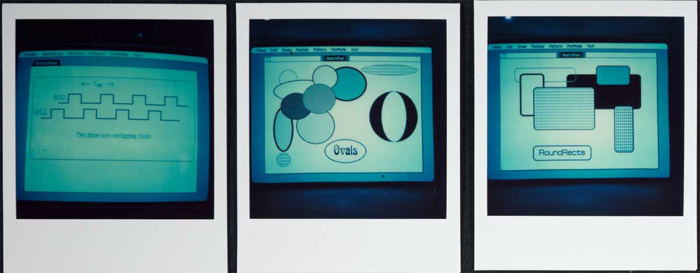

Bud Tribble was living at Bill's house now, and tended to sleep during the day and work all night, so Bill drew the  phase diagram diagram on the left with the sketch program.   The middle picture shows fast ovals, which were added to LisaGraf as a basic type in Spring 1981, using a clever algorithm that didn't require multiplication.  They were quickly followed by rectangles with rounded corners, or "roundrects", illustrated on the right, which were suggested by Steve Jobs (see Round Rects Are Everywhere!).

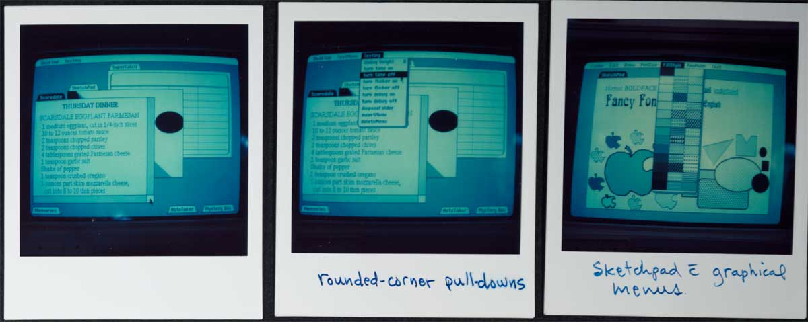

By May 1981, the Lisa user interface is beginning to solidify.  The leftmost photo shows scrollable documents of different types in overlapping windows, still sporting folder tabs for titles.   The middle picture shows how roundrects began to creep into various UI elements, like menus, providing a more sophisticated look, especially when combined with drop shadows.   The right most photo shows how menus could be also be graphical, as well as text based. 

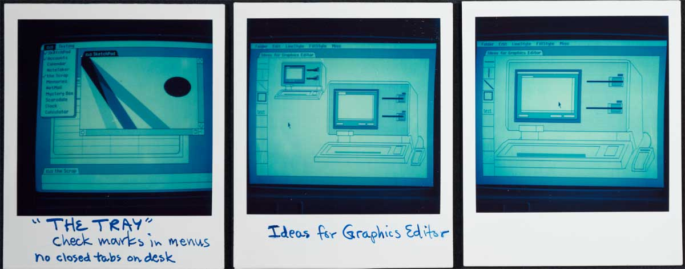

The Lisa team was worried about the closed window tabs being obscured by other windows on the desktop, so Bill added a standard menu on the extreme left called "the tray", that could show and hide opened windows.  The middle and right pictures portray a prototype that Bill created for the Lisa Graphics Editor (which eventually evolved into MacDraw), to demonstrate that modes could sometimes be useful; it was the first program to select modes with a graphical palette, which eventually became the main user interface of MacPaint.

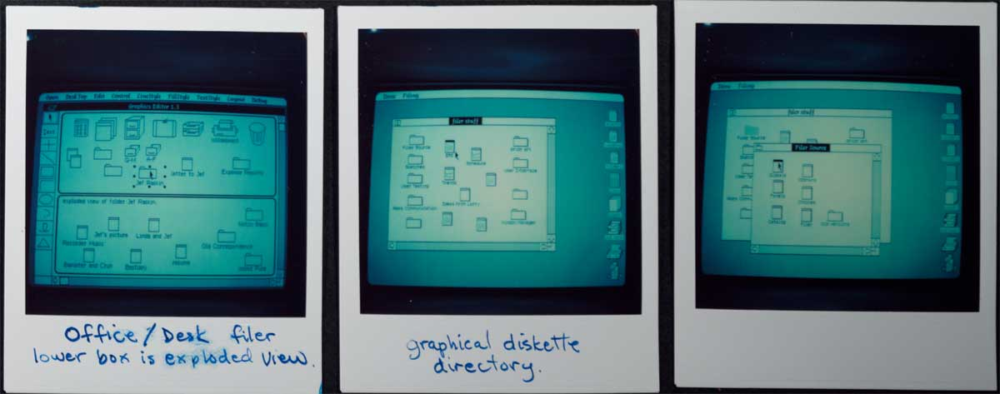

The last major change in the Lisa User Interface was moving to an icon-based file manager in March 1982.   The leftmost picture was an early mock-up done in the graphics editor, using a two-level hierarchy; selecting an icon in the top pane displays its contents in the bottom one.   By the middle photo, Bill arrived at something very similar to the shipping design, complete with a trash can at the lower right. (see Rosing's Rascals).  Note that the folder tab on windows has disappeared now, replaced by a rectangular title bar that's partially inverted when highlighted.

Finally, Bill renamed "LisaGraf" to "QuickDraw" in the spring of 1982, because he wanted a name that was suitable for the Macintosh, too.  He added two related features to meet the burgeoning needs of the Lisa applications: pictures and scaling.   Pictures were a way of recording graphics operations into a data structure for later playback; this became the basis of both our printing architecture and also cutting and pasting graphics.   Since pictures could be drawn into an arbitrary sized rectangle, it also caused Bill to add bitmap scaling features as well.

* * *

Most users and developers only experienced the user interface as a completed whole, so they tend to think of it as static and never changing, when in fact these pictures show that it was always evolving as we gained more experience and tackled more application areas.   A user interface is never good enough, and, while consistency between applications is an important virtue, the best developers will continue to innovate when faced with new problems or perhaps just when they see a much better way to accomplish something.   As usual, Bob Dylan said it best when he wrote in 1965, "He not busy being born, is busy dying."