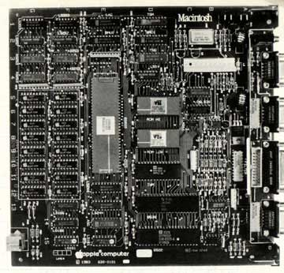

# Five Different Macintoshes
* Author: Andy Hertzfeld
* Story Date: undated
* Topics: Hardware Design, Technical, Prototypes
* Characters: Burrell Smith, Bud Tribble, Wendell Sander, Steve Jobs, Jef Raskin, Bill Atkinson
* Summary: Burrell actually designed 5 different Macintoshes

 
    
The awesomely creative design of the Macintosh digital board was always the seed crystal of brilliance at the core of the project,  but there wasn't just one design; Burrell redesigned the digital board four different times as development proceeded, finally arriving at the shipping design in the fall of 1982.

The first Macintosh digital board, designed in late 1979, was based on Jef Raskin's specifications: it had a Motorola 6809E microprocessor, 64K of memory, and a 256x256 black and white, bit-mapped graphics display.  Even in this first design, Burrell was using his trademark 'PAL' chips, which were small, programmable logic arrays, to provide all of the system glue, so the system had a very low chip count.

The first Macintosh was a cute little computer, but it was fundamentally limited by the 6809 microprocessor, which only had 16 bits of address space.  Bill Atkinson was doing incredible work on the Lisa project using Motorola's 68000 microprocessor, with its capacious 32 bit registers and 24 bit address space.  Bud Tribble, the Mac's only software person, was living at Bill's house, and watching the extraordinary progress on Lisa's graphics package.  He began to wonder if it was possible for the Macintosh to use the 68000, so it could run Bill's graphics routines.

Bud began asking Burrell if it was feasible to include the 68000 in a low cost design.  The 68000 was expensive enough on its own, but its 16 bit memory bus required twice as many RAM chips as the 6809, so the overall cost was significantly more expensive.  But Burrell thought about the problem and came up with a characteristically brilliant idea for his second Macintosh design.

The idea was what Burrell called a "bus transformer" circuit, built out of PAL chips, which adapted the 68000 to an 8 bit memory bus by exploiting the fast "page mode" access mode of the RAMs.  The new Macintosh, designed over the Christmas break at the end of 1980, featured an 8 megahertz 68000, 64K of RAM, and a 384 by 256 bit mapped display.  It was 60% faster than the Lisa (which used a 5 megahertz 68000) but a lot less expensive.

When Steve Jobs caught wind of what Burrell had come up with - an Apple II priced machine that blew away the Lisa, he became really excited, and saw that Burrell's machine could become the future of Apple.  Steve's attention was the beginning of the end for Jef, though, who despised parts of Steve's personality and couldn't put up with Steve's courting of Burrell and Bud.  Steve took over the project in January 1981,  and the Macintosh entered the post-Jef era, on track to becoming a real product.

Burrell's third Macintosh design was done in June 1981.  The main reason was that he fell in love with a communications chip called the SCC.  The SCC could support a built-in local area network, making AppleTalk possible with no additional hardware, as well as providing nice buffered serial ports with interrupts and other hardware features.  At this point it also was becoming obvious that we needed at least 128K of memory to support the user interface, so he also added a second row of RAM chips.

Around the end of 1981, Burrell met some engineers who were doing custom LSI chips, which were very flexible and powerful but very time consuming to design, since the software tools were still in their infancy.  Burrell decided that he wanted to take a shot at building the Macintosh around a single custom chip, and convinced Steve that he could pull it off.   Instead of sitting around doing nothing while the software team finished the product, he would work with a couple of experienced LSI designers and redesign the Mac around what he called the "Integrated Burrell Machine".

Earlier in the year, Wendell Sander, the designer of the Apple III and one of Apple's best engineers, did a small custom chip that crammed all the functionality of Woz's disk controller into a single chip. It was called the "IWM" chip, which stood for the "Integrated Woz Machine", since Woz's disk controller is really an elaborate state machine, but it also stood for the "Integrated Wendell Machine". So when Burrell envisioned a single custom chip for the Macintosh, he called it the "IBM" chip, for "Integrated Burrell Machine", relishing the potential confusion the name might cause.

In the beginning of 1982, the original 68000 design was more than a year old, and the software was nowhere near finished, so Burrell was afraid some of the trade-offs of the original design were no longer current.  He used the expansive canvas of a custom chip, where additional logic was almost free, to update the architecture.   The most important decision was admitting that the software would never fit into 64K of memory and going with a full 16-bit memory bus, requiring 16 RAM chips instead of 8.  The extra memory bandwidth allowed him to double  the display resolution, going to dimensions of 512 by 342 instead of 384 by 256.  He also added bells and whistles like a fancy, DMA-fed sound generator with four independent voices.  This was the fourth version of the Macintosh design.

But Burrell had never done a custom chip before.  He was counting on experts working with our partner VLSI Design, mainly Doug Fairbairn and Martin Haeberli, who successfully made a custom chip for an optical mouse, but they had never really worked against commercial deadlines, and a lot of tension began to build as the schedule started to slip.

Some more of the details of the Integrated Burrell Machine project are told elsewhere, but eventually, after the first silicon from an early version didn't work as expected, Burrell became frustrated and decided that it was too risky to continue.  He realized that he could do a design with PALs that achieved most of the gains from the Integrated Burrell Machine, without needing the custom chip.  So, in August 1982, he quickly designed the fifth iteration of the Macintosh, the one that actually shipped in January 1984, by adapting his earlier PAL-based design to one that had a 16-bit memory bus with a 512 by 342 display and some other features invented for the custom chip.