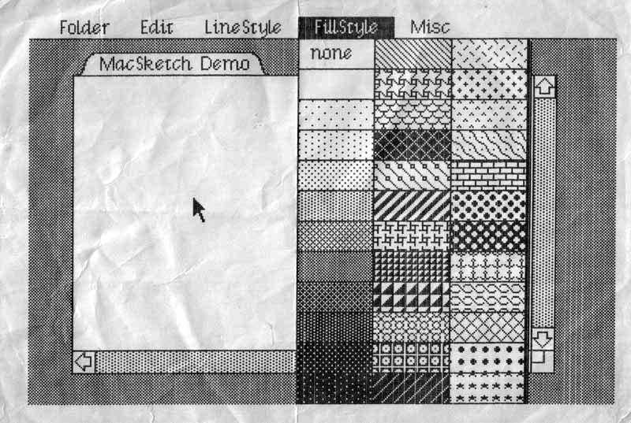
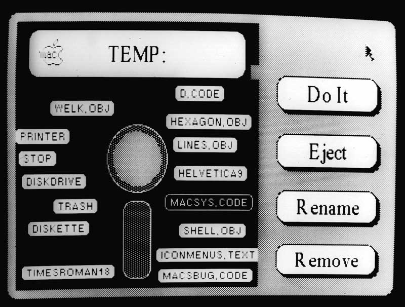
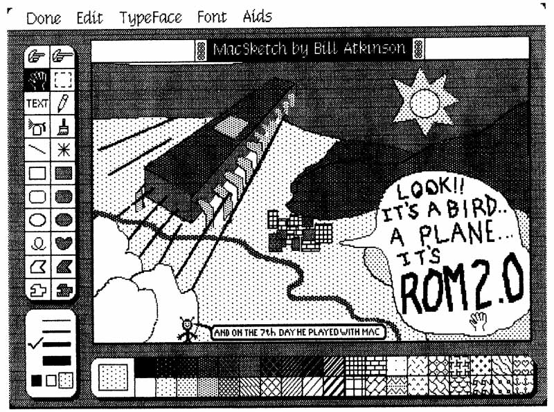
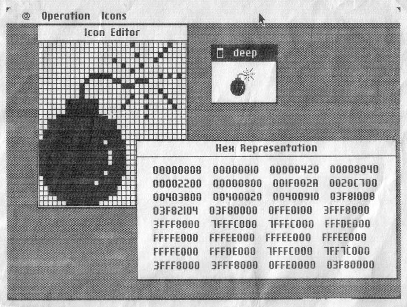
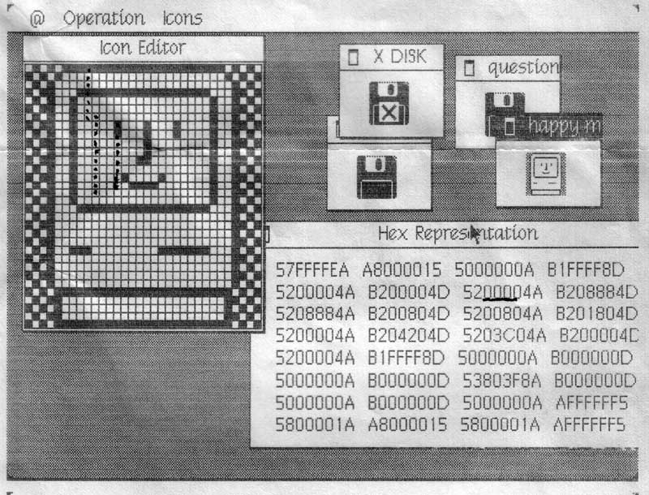
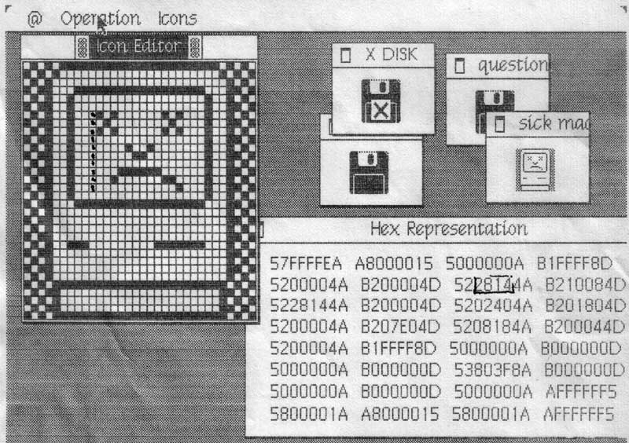

# Busy Being Born, Part 2
* Author: Andy Hertzfeld
* Story Date: undated
* Topics: 
* Characters: Bud Tribble, Bill Atkinson, Bruce Horn, Steve Capps, Susan Kare
* Summary: Here are a few seminal Macintosh screenshots, ala the Lisa polaroids

Bill Atkinson had the foresight to document the creation of the Lisa User Interface by keeping a polaroid camera near his computer, taking a snapshot of each significant milestone (see Busy Being Born).   Although we didn't systematically save pictures of key Mac milestones, I've managed to cobble together a few seminal Macintosh screenshots to present here in a similar fashion.

Bud Tribble had a tendency to work late at night.  I usually came to work at Texaco Towers around 10:30AM, so if Bud was there when I arrived, it usually meant that he had spent all night there.  One morning, in the middle of May 1981, when I arrived at my usual time, Bud was anxious to show me something before I could even take off my backpack.

I knew that Bud had been working on the initial porting of QuickDraw to the Macintosh, but I thought that he was at least a week away from getting it running. At this point, we had some cursor routines going, and a way to download and execute Pascal programs that were compiled on a Lisa, attached to the Mac by a serial cable.  But we didn't have a memory manager yet, or an event manager or file system, so Bud had to build scaffolding in various places to overcome these limitations.  He had compiled a bitmap drawing program that Bill wrote in Pascal for Lisa, then linked it with LisaGraf and other library routines, and started to debug it, fixing each problem as it manifested.

Bud had made a huge amount of progress the previous evening, and the demo was substantially running now.  It was incredibly exciting to see Mac-like software running on the Mac for the very first time.  The demo featured working pull-down menus, complete with a nicer style of drop shadow than the Lisa was using, and an elaborate, graphical pattern menu, which is illustrated in the screenshot above.

Xerox aficionados will note the use of Cream 12 as our first system font, which was the default font used by SmallTalk, that Bill had converted to the Lisagraf font format.  The window title bar was a folder tab, because we were still confused about the difference between folders and documents.  The demo already had scroll bars and a grow box that is pretty similar to what we ended up shipping with, although you couldn't interact with them yet.  In fact, the only part of the program that actually did something was the "Quit" command.

In April, I had written some screen printing code, that dumped whatever was on the display out the serial port to a dot matrix printer.  Since the Mac screen was rather small, I added a feature to print it at double size, so it mostly filled a page.   I used that to print the display of Bud's demo, with the impressive graphical pattern menu pulled down, on the very day that Bud got it working, and that's what is reproduced above.

Bruce Horn joined the Mac team in late 1981 (see Joining The Mac Group), with the charter to write a graphical shell that we were calling the "Finder", since it helped the user find applications and documents to launch.  We were influenced by ideas from the Architecture Machine group at MIT (a predecessor to the better known Media Lab) as portrayed in a program called "DataLand" that allowed users to manipulate graphical objects in spacial arrangements.  Bruce was excited about spacial data management and his first assignment was to write a prototype to explore how it could work on the Mac.

Bruce came up with the idea of representing files as small tabs superimposed on an image of a floppy disk.  He wrote a prototype that he called "the micro-finder", which is pictured above.  I started helping him implement various parts of it, and pretty soon it was actually useful.  You could drag the file tabs to position them, and click on the large buttons on the right to launch programs or rename and delete files.  We used the micro-finder through most of 1982 for demoing the Mac until the real Finder started becoming usable around the end of the year.

After the micro-finder, Bruce also worked on another prototype that included folders in a two-pane view (Bruce thinks he can eventually dig up a picture of it; if he does I'll include it here).  Meanwhile, Bill Atkinson was crafting an icon-based file manager prototype for Lisa (see Rosing's Rascals), and eventually we decided to follow that direction for the Macintosh.

Here is a very early version of MacPaint, probably from March 1983, after Bill had been working on it for around one month.  The first thing to notice is that it wasn't called "MacPaint" yet - it still bore its original name, "MacSketch", inherited from its predecessor, LisaSketch.  

This early version uses icons designed by Bill himself, before Susan Kare got a chance to tweak them.  And some of the most important MacPaint tools like the paint bucket and the lasso are still months away from being implemented.

MacPaint contained a menu of miscellaneous tools, like Fat Bits, originally called the "Aids" menu, as you can see above.   But in the summer of 1983, with public awareness of the AIDS epidemic beginning to swell, Bill rechristened it the "Goodies" menu.

It's interesting to note the window highlighting decorations, which are quite different than what we ended up with.  We must have tried dozens of different ways to highlight windows before arriving at the horizontal lines in August 1983. 

The featured MacPaint document was drawn late one night by Steve Capps, to celebrate one of our ROM releases;  he also saved and scanned the document for inclusion here.

In early 1983, I wrote an icon editor based on Bill Atkinson's "Fat Bits" pixel editing techniques that Susan Kare used to craft most of the early Mac icons.  The icon editor displayed both a large and actual size representation of the icon, and allowed editing multiple icons at once.   I needed a way to incorporate the icons into the ROM, so I added a feature called the "Hex Window", that displayed the representation of the current  icon in hexadecimal, which is what I needed to add the icons to the Mac ROM source code.   The screen dumps on the left are the actual ones used to enter some famous Mac icons into ROM, like the bomb and the happy Mac.

Note that the name on the window containing the bomb icon is "Deep".  That's the first word of the original name of the code that displayed the dreaded bomb icon on the screen.  Originally the code had an obscene name, with the API calls prefixed with "DS".   Jerome came up with various euphemisms for it, like the "Deep Sauce" manager evolving into the "Dire Straights" manager, eventually settling on the more prosaic "System Error" manager.