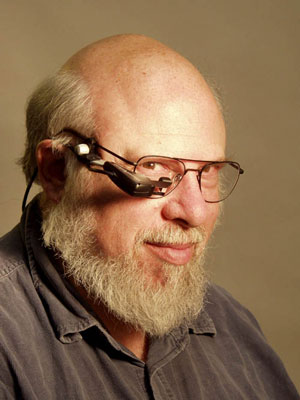

# The Father Of The Macintosh
* Author: Andy Hertzfeld
* Story Date: undated
* Topics: Credit, Personality
* Characters: Bud Tribble, Steve Jobs, Joanna Hoffman, Jef Raskin, Rod Holt, Burrell Smith, Brian Howard, Steve Wozniak, Jerry Manock, Bill Atkinson, Mike Markkula
* Summary: Who is the father of the Macintosh?

In the early days of the personal computer industry, breakthrough products could still be created single-handedly, or by very small teams.  Steve Wozniak is indisputably the father of the Apple II, having designed the entire digital board himself as well as writing all of the system software, including a BASIC interpreter, most of it before Apple was even incorporated.  But even Woz required help from Rod Holt for the analog electronics (the Apple II's switching power supply was almost as innovative as the digital board) and Steve Jobs and Jerry Manock for the industrial design (ditto for the plastic case).

By the 1980s, things had gotten more complicated.  The Macintosh was more of a team effort, with at least a half dozen people making significant, invaluable contributions.  For the launch publicity, Steve Jobs anointed seven of us (not counting himself) as the official "design team", but it could just as easily have been five or fifteen.  Some people felt bad that they weren't included, and it was obvious that there was no good way to draw the line.

But if you look up the phrase "Father of the Macintosh" on Google, you get lots of links mentioning the initiator of the project,  Jef Raskin.  Jef was a former professor at UCSD (of both computer science and music) who started at Apple in January 1978 as Apple employee #31, after contracting to write Apple's manual for Basic with his friend Brian Howard, at their consulting firm named Bannister and Crun (a playful name appropriated from the Goon Show).  Apple liked the Basic manual so much that they hired Jef and Brian to be founders of their internal publications group.
 

In early 1979, after successfully building an outstanding pubs department, Jef turned the reins over to Phyllis Cole and started thinking about what it would take for personal computers to expand beyond the current hobbyist market, writing up his ideas in a series of short papers.  He presented his idea for an ultra low cost, easy to use appliance computer to Mike Markkula in March 1979, and got the go-ahead to hire a few people and form an official research project later in September 1979, naming it Macintosh, after his favorite kind of eating apple.  Most of his ideas for the new machine were collected in a set of papers he called "The Book of Macintosh".

There's no doubt that Jef was the creator of the Macintosh project at Apple, and that his articulate vision of an exceptionally easy to use, low cost, high volume appliance computer got the ball rolling, and remained near the heart of the project long after Jef left the company.  He also deserves ample credit for putting together the extraordinary initial team that created the computer, recruiting former student Bill Atkinson to Apple and then hiring amazing individuals like Burrell Smith, Bud Tribble,  Joanna Hoffman and Brian Howard for the Macintosh team.   But there is also no escaping the fact that the Macintosh that we know and love is very different than the computer that Jef wanted to build, so much so that he is much more like an eccentric great uncle than the Macintosh's father.

Jef did not want to incorporate what became the two most definitive aspects of Macintosh technology - the Motorola 68000 microprocessor and the mouse pointing device.  Jef preferred the 6809, a cheaper but weaker processor which only had 16 bits of address space and would have been obsolete in just a year or two, since it couldn't address more than 64Kbytes.  He was dead set against the mouse as well, preferring dedicated meta-keys to do the pointing.  He became increasingly alienated from the team, eventually leaving entirely in the summer of 1981, when we were still just getting started, and the final product utilized very few of the ideas in the Book of Macintosh.  In fact, if the name of the project had changed after Steve took over in January 1981, and it almost did (see Bicycle), there wouldn't be much reason to correlate it with his ideas at all.

So, if not Jef, does anyone else qualify as a parent of the Macintosh?  Bill Atkinson is a strong candidate, since he was almost singlehandedly responsible for the breakthrough user interface, graphics software and killer application that distinguished the Mac.  A case could also be made for Burrell Smith, whose wildly creative digital board was the seed crystal of brilliance that everything else coalesced around.   But ultimately, if any single individual deserves the honor, I would have to cast my vote for the obvious choice, Steve Jobs, because the Macintosh never would have happened without him, in anything like the form it did.  Other individuals are responsible for the actual creative work, but Steve's vision, passion for excellence and sheer strength of will, not to mention his awesome powers of persuasion, drove the team to meet or exceed the impossible standards that we set for ourselves.  Steve already gets a lot of credit for being the driving force behind the Macintosh, but in my opinion, it's very well deserved.