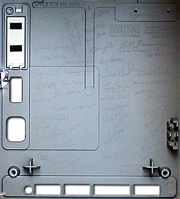

# Signing Party
* Author: Andy Hertzfeld
* Story Date: February 1982
* Topics: Management, Apple Spirit, Industrial Design
* Characters: Steve Jobs, Bob Belleville, Jerry Manock, Mac Team, Bud Tribble, Jef Raskin, Mike Boich, Rod Holt, Steve Wozniak, Mike Murray
* Summary: The artists sign their work

 

    
The component of the Macintosh hardware that had the longest lead time was the hard tool that molded its distinctive plastic case.  After tweaking the case design for more than six months and building a small production run of 50 units with a soft-tooled case, the final design was ready to go out for hard tooling toward the end of February 1982, so we could meet the ship date that we were aiming for at the time, which was January 1983.

The Mac team had a complicated set of motivations, but the most unique ingredient was a strong dose of artistic values.  First and foremost, Steve Jobs thought of himself as an artist, and he encouraged the design team to think of ourselves that way, too.  The goal was never to beat the competition, or to make a lot of money; it was to do the greatest thing possible, or even a little greater.  Steve often reinforced the artistic theme; for example, he took the entire team on a field trip in the spring of 1982 to the Louis Comfort Tiffany museum, because Tiffany was an artist who learned how to mass produce his work.

Since the Macintosh team were artists, it was only appropriate that we sign our work.  Steve came up with the awesome idea of having each team member's signature engraved on the hard tool that molded the plastic case, so our signatures would appear inside the case of every Mac that rolled off the production line.  Most customers would never see them, since you needed a special tool to look inside, but we would take pride in knowing that our names were in there, even if no one else knew.

We held a special signing party after one of our weekly meetings on February 10, 1982. Jerry Mannock, the manager of the industrial design team,  spread out a large piece of drafting paper on the table to capture our signatures.  Steve gave a little speech about artists signing their work, and then cake and champagne were served as he called each team member to step forward and sign their name for posterity.  Burrell had the symbolic honor of going first, followed by members of the software team.  It took forty minutes or so for around thirty-five team members to sign. Steve waited until last, when he picked a spot near the upper center and signed his name with a flourish.

We were aware that the team was still growing rapidly, and in a few months there would be a new crop of key contributors that also deserved to sign the case.  We decided to draw the line at the date of the signing party, and not to let new signatures come in later, but we knew it would be tough to stick to that.  We also wanted to add the signatures of a few major contributors who had left the project: Steve Wozniak, Jef Raskin and Bud Tribble.  But that was supposed to be it.

Over the next few months, a few more signatures of people who weren't on the team at the time of the signing party managed to make it into the case.  For a while Rod Holt held the line, but eventually Bob Belleville, who hired on in April 1982 as the software manager but soon became the overall engineering manager when Rod Holt retired, decided to add his own name.  He also snuck in a few other key people, like marketing manager Mike Murray and original evangelist Mike Boich, who started before he did and who otherwise would have just missed the cut-off.

And then, over time, names gradually began to disappear for practical reasons, as Apple changed the case to make it easier to manufacture.  Some details were changed even before first ship, partially obscuring some of the signatures.   Each time the case was revised, more names were left off, as dictated by the nature of the revision, until a substantial number of them were gone.  I'm not sure which model was the last to have any names at all, but I'm pretty sure that the Macintosh Classic, from the early nineties, didn't have any left.

