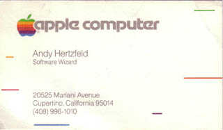

# Software Wizard
* Author: Andy Hertzfeld
* Story Date: March 1982
* Topics: Personality, Apple Spirit
* Characters: Andy Hertzfeld, Burrell Smith, Steve Jobs
* Summary: The Mac group gets business cards

 

By the spring of 1982, the Macintosh project was considered more legitimate within Apple.  It was beginning to transition from a research effort into a mainstream project.  We had to get more organized as the team grew.

Initially, we didn't have formal titles in the Mac group, but we needed to figure out what they were in order to get business cards made.  My title with the Apple II group was "Senior Member of Technical Staff", which sounded dull to me.  I told Peggy Alexio, Rod Holt's secretary, who was ordering the business cards, that I didn't want any, because I didn't like my title.

The next day Steve came by and told me that he heard that I didn't want business cards, but he wanted me to have them, and he didn't care what title I used; I could pick any title that I liked.  After a little bit of thought, I decided on "Software Wizard", because you couldn't tell where that fit in the corporate hierarchy, and it seemed a suitable metaphor to reflect the practical magic of software innovation.

When I told Burrell about my new title, he immediately claimed "Hardware Wizard" for himself, even though I discouraged him, since it diminished the uniqueness of my title.  And, as soon as word got around, lots of other folks on the Mac team started to change their titles to something more creative.  The trend persisted at Apple for many years, and even spread to other companies, but as far as I know, that's how it got started.