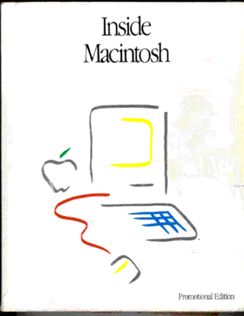

# Inside Macintosh
* Author: Andy Hertzfeld
* Story Date: June 1982
* Topics: Documentation, Software Design, Lisa
* Characters: Steve Jobs, Joanna Hoffman, Randy Wigginton, Bill Atkinson, Chris Espinosa, Caroline Rose, Steve Chernicoff, Brad Hacker, Bob Anders
* Summary: Developer documentation was crucial to our success.

 

    
One of the main differences between the Lisa and Macintosh projects was the way that they viewed third party developers. The Lisa team was writing an integrated suite of seven office-oriented applications internally, so they didn't see a need to support third party developers at first, although they planned to do it eventually.

The Macintosh, inspired by the Apple II, took a different approach. The Apple II's sales had increased more than ten-fold when a tiny company named Software Arts released the first spreadsheet, Visicalc, which initially ran only on the Apple II.  We wanted all the people who resonated with our Macintosh dream to be able to extend it with own creativity, so having first class support for third party developers was considered to be a must, from the very beginning.

But that was easier said than done.  Lisa's stance was quite reasonable, because consistency between applications was very important to us.  There were virtually no third party developers who were familiar with a graphical user interface, so we had to educate them about a whole new approach to programming.  In those days, every application provided its own unique user interface, and we weren't sure that it was even possible to coordinate independent developers to conform to our ideas about a consistent user interface. 

In fact, in early 1982 our user interface was still evolving, and everyone on the team didn't necessarily agree about the best way to do things, especially in situations that hadn't been considered yet.  It seemed like the next logical step was to formally document and codify our user interface, to identify and resolve open issues and communicate it to third party developers.

One forcing function was a looming meeting with our initial third-party developer, Microsoft (see Shut Up!), who was coming to pick up their first Macintosh prototypes and developer documentation around the end of January.  We held a series of intense, all day meetings in the second week of January 1982, to thrash out disagreements and formulate a shared view of the UI, metaphorically locking ourselves in a room until we came to consensus.   The meetings were attended by Steve Jobs, Bill Atkinson, Joanna Hoffman, Chris Espinosa, Randy Wigginton (who had left Apple in September 1981, but agreed to write MacWrite for us as a semi-independent developer) and me. 

The Lisa User Interface was our obvious starting point, but we had a drive to simplify things, and tried to strip out anything that seemed too complex.  Triple-click was easy to get rid of, for example, but it was hard to agree about the details of scroll bars.  After two and a half days, we thought that we were more or less in agreement, and decided that Joanna should write up the current state of the design.  She wrote the first draft of the "Macintosh User Interface Guidelines" in time for the Microsoft meeting the following week, where we presented it for the very first time.  Eventually, Chris Espinosa took over authorship of the guidelines, augmenting and amending them as necessary as development proceeded.

By April 1982, the first implementation of the User Interface Toolbox, which contained the code that implemented UI objects like windows, menus, buttons and scrollbars, was ready for the initial release to developers. Since most developers had never programmed a graphical user interface before, it was very important to write high quality developer documentation to explain the ins and outs of using the toolbox.  Chris Espinosa had already written some excellent documentation for using QuickDraw, so we were off to a good start. 

 I met with Chris about the toolbox documentation and we decided to tackle the window manager first.  He assigned a recently hired technical writer, a women in her mid-twenties who will remain mercifully nameless in this story, to work with me to document the Window Manager API.

One afternoon, I sat down with the writer for a few hours with some print-outs of the source code, and went over the Window Manager API with her in fine detail.  I was a bit worried because I did most of the talking, and she didn't ask any questions, but she promised to show me her first draft in just a few days.

A few days later, Chris Espinosa handed me a few pages of Window Manager documentation, with the caveat that it was a very early draft, so I shouldn't expect too much.   But my heart sank as I began to read it.   The actual window manager calls were accurately reproduced, as were the comments from the header file, but the descriptions of each call made no sense; it was clear that she didn't understand many of the underlying QuickDraw and memory manager concepts, and instead of asking for an explanation, she just made up whatever popped into her head.

I had a panicky meeting with Chris, but he was able to calm me down and convince me to give the writer another chance.  I met with both of them, explaining the problems that I had with what she had done so far.  She was amazingly blithe and cheerful about it, saying that she knew that she didn't understand everything, but figured that I would correct anything that was wrong.   We had another longer meeting, where I did my best to explain the underlying concepts like handles and regions, and went over the Window Manager API again, this time asking her if she had any questions at the end of each routine.   It still seemed to me like she was having trouble understanding things, no matter how carefully I tried to explain, but she didn't seem worried about it at all.

The next draft was just as bad as the previous one, and I felt even worse, given all the effort that I put into it.  Chris was defensive, and I began to despair of ever getting decent documentation for the toolbox.  So I was suprised when he entered my cubicle a couple of days later, with a smile on his face.

"We've just made an offer to a new writer", he told, "someone who I think will do a much better job on the technical side of things, since she used to be a programmer.  Her name is Caroline Rose.  I'm going to assign her to the window manager documentation and see what you think."

The next week I sat down to meet with Caroline for the first time, and she couldn't have been more different than the previous writer.   As soon as I began to explain the first routine, she started bombarding me with questions.   She didn't mind admitting it when she didn't understand something, and she wouldn't stop badgering me until she comprehended every nuance.   She began to ask me questions that I didn't know the answers to, like what happened when certain parameters were invalid.  I had to keep the source code open on the screen of my Lisa when I met with her, so I could figure out the answers to her questions while she was there.

Pretty soon, I figured out that if Caroline had trouble understanding something, it probably meant that the design was flawed.   On a number of occasions, I told her to come back tomorrow after she asked a penetrating question, and revised the API to fix the flaw that she had pointed out.   I began to imagine her questions when I was coding something new, which made me work harder to get things clearer before I went over them with her.

Initially, we distributed the raw documentation to developers piecemeal, as it was written, but eventually we wanted to collect it into one definitive reference called "Inside Macintosh".   It was almost 1000 pages long, spread across three volumes, mostly written by Caroline with help from Bob Anders, Brad Hacker, Steve Chernicoff and a few others.  Steve Jobs insisted on very high production standards for the first edition, naturally, using only the best binding and paper available.  But high quality printing takes time, and the evangelists were impatient to get the definitive documentation out to developers as soon as possible.

I'm not sure whose idea it was, but a compromise was finally reached.  Apple would publish a free, soft-bound "promotional" edition of Inside Macintosh on low quality paper as soon as possible, and send a copy for free to every developer.   It was about as thick and flimsy as the Yellow Pages, so it became known as the "phone book" edition.  Most developers still bought the high quality, beautiful hardback edition when it came out a few months later, anyway.

