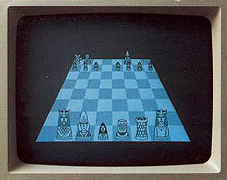
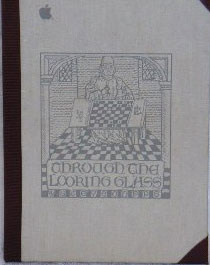
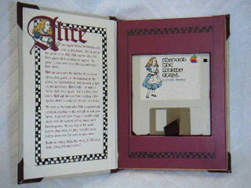
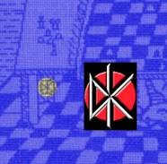

# Alice
* Author: Andy Hertzfeld
* Story Date: June 1982
* Topics: Software Design, Games, Lisa, Marketing
* Characters: Steve Capps, Bruce Daniels, Steve Jobs, Joanna Hoffman
* Summary: The Macintosh's first great game

 
   
Even though Bruce Daniels was the manager of the Lisa software team, he was very supportive of the Mac project.  He had written the mouse-based text editor that we were using on the Lisa to write all of our code, and he even transferred to the Mac team as a mere programmer for a short while in the fall of 1981, before deciding that he preferred managing for Lisa.  He would sometimes visit us to see what was new, but this time he had something exciting to show us.

"You've got to see the new game that Steve Capps wrote", he told me while he was connecting his hard drive up to my Lisa.  He booted up into the Lisa Monitor development system, which featured a character-based UI similar to UCSD Pascal, and launched a program named "Alice".  Steve Capps was the second member of the Lisa printing team, who started at Apple in September 1981.  I had seen him around but not really met him yet.

The screen turned black and then, after a few seconds delay, a three dimensional chess board in exaggerated perspective filled most of the screen.  On the rear side of the board was a set of small, white chess pieces, in their standard positions.  Suddenly, pieces started jumping into the air, in long, slow parabolic arcs, growing larger as they got closer.

Soon there was one specimen of each type of piece, all rather humanoid looking except for the tower-like rook, lined up on the front rank of the board, waiting for the player to click on one to start the game.  The player would be able to move like the piece they chose, so it was prudent to click on the queen, at least at first.

The pieces jumped back to their natural positions on the far side of the board, and an image of a young girl in an old fashioned dress floated down to the front row, which represented Alice from Lewis Carroll's "Alice in Wonderland" and "Through the Looking Glass" books,  drawn in the style of the classic John Tenniel illustrations.  The player controlled Alice and viewed the board from her perspective, facing away from the player so you only saw her from the rear. 

A three digit score, rendered in a large, ornate, gothic font, appeared centered near the top of the screen, and then the game began in earnest, with opposing chess pieces suddenly leaping into the air, one at a time, in rapid succession.  If you stood in one place for too long, an enemy piece would leap onto Alice's square, capturing her and ending the game.

It didn't take long to figure out that if you clicked on a square that was a legal move, Alice would leap to it, so it wasn't too hard to jump out of the way of an enemy piece.  And, if you managed to leap onto the square of another piece before it could move out of the way, you knocked it out of action and were rewarded with some points.  You won the game if Alice was the last one standing.

I was impressed at the prodigious creativity required to recast "Through The Looking Glass" as an action-packed video game that was beautiful to behold and fun to play.  Alice was also addicting, although it took some practice to be able to survive for more than a few minutes.  Obviously, we needed to have it running on the Mac as soon as possible.

Bruce Daniels seemed pleased that we liked the game. "Capps could probably port Alice to the Mac", he said, anticipating what we were thinking.  "Do you think you could get him a prototype?"

Everyone agreed that we should get Capps a Mac prototype right away.  I accompanied Bruce Daniels back to the Lisa building (where the rules required that non-Lisa employees be escorted by a Lisa team member), and I finally got to meet Steve Capps, who seemed easy-going and friendly, with a self-deprecating sense of humor.  Later that afternoon, he visited Texaco Towers and I gave him the prototype and answered a few questions about the screen address and the development environment.  He assured me that it wouldn't take that long to port.

Two days later, Capps came over to present us with a floppy disk containing the newly ported Alice game, now running on the Macintosh.  It ran even better on the Mac than the Lisa, since the Mac's faster processor enabled smoother animation.  Pretty soon, almost everybody on the software team was playing Alice for hours at a time.  

Within a few weeks, I must have played hundreds of games of Alice, but the most prolific and accomplished player was Joanna Hoffman, the Mac's first marketing person.  Joanna liked to come over to the software area toward the end of the day to see what was new, and now she usually ended up playing Alice for longer and longer periods.  She had a natural talent for the game, and enjoyed relieving work-related stress by knocking out the rival chess pieces.  She complained about the game being too easy, so Capps obliged by tweaking various parameters to keep it challenging for her, which was probably a mistake, since it made the game much too hard for average players.

Steve Jobs didn't play Alice very much, but he was duly impressed by the obvious programming skill it took to create it.  "Who is this Capps guy?  Why is he working on the Lisa?", he said as soon as he saw the program, mentioning Lisa with a hint of disdain.  "We've got to get him onto the Mac team!"

But the Lisa was still months away from shipping, and Capps was needed to finish the printing software, so Steve wasn't able to effect the transfer.  One weekend Capps ran into Steve Jobs in Los Gatos and was told, "Don't worry, the Mac team is going to nab you!" Finally, a compromise was reached, that allowed Capps to transfer over in January 1983 after the first release of the Lisa was completed.

Capps quickly became a crucial member of the Mac team, adding fresh energy and talent as we entered the home stretch, helping to finish the Toolbox and the Finder, as well as working on other stuff like "Guided Tour" diskette.  But he also found time to embellish Alice with more cool features.

One day he showed me Alice's hidden "Cheshire Cat" menu, which allowed you to adjust various preferences.  Alice didn't have a menu bar, so it was sort of part of the game to figure out how to invoke the preferences. It was accomplished by clicking on the score at the top of the screen, which caused a detailed, John Tenniel inspired Cheshire Cat bitmap to slowly fade into view; clicking on different parts of it set various preferences. Capps also created an exquisite, tiny rendering of the Cheshire Cat to serve as Alice's icon.

Over time, he added some interesting variations, invoked by clicking on various parts of the Cheshire Cat.  For example, one variation made some of the squares of the chessboard disappear at random, causing unlucky pieces to fall through to oblivion below.  He also added a feature that Woz suggested:  as the cursor moved to the back of the board, its image got correspondingly smaller, adding to the illusion of depth.

By the fall of 1983, Capps started thinking about the best way to get Alice to market.  One possibility was publishing it through Electronic Arts, which was founded a year earlier by Trip Hawkins, Lisa's former marketing manager.   But Steve Jobs thought that the game at least partially belonged to Apple, and insisted that Apple be the publisher.  He negotiated a modest deal with Capps, promising him that Apple would do a deluxe job with the packaging and marketing.

  

Alice was announced at the launch and featured in the original brochure, but it didn't became available until a couple of months later.  True to Steve's word, the packaging was beautiful.  The game disk was enclosed in a small cardboard box designed to look like a finely printed, old fashioned book, complete with an elaborate woodcut on the cover, that contained a hidden Dead Kennedy's logo, in tribute to one of Capp's favorite bands.  Since Alice didn't take up the whole disk, Capps including a few other goodies with it, including a font and "Amazing", a fascinating maze generating program that he wrote.

When I saw the completed packaging, I was surprised to discover that the game wasn't called "Alice" anymore;  apparently, that name was already trademarked for a database program.  It was rechristened "Through The Looking Glass" for its commercial release.

Unfortunately, Apple never put the promised marketing effort into Alice.  They were in a quandary because the market didn't understand the graphical user interface as a productivity enhancement yet; graphics meant games, so the Mac had to live down an initial reputation as being unsuitable for business tasks.  Apple didn't exactly want to promote a game for the Mac at the time, no matter how sensational, so Alice never quite reached as wide an audience as it deserved.