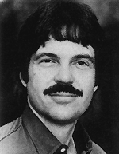
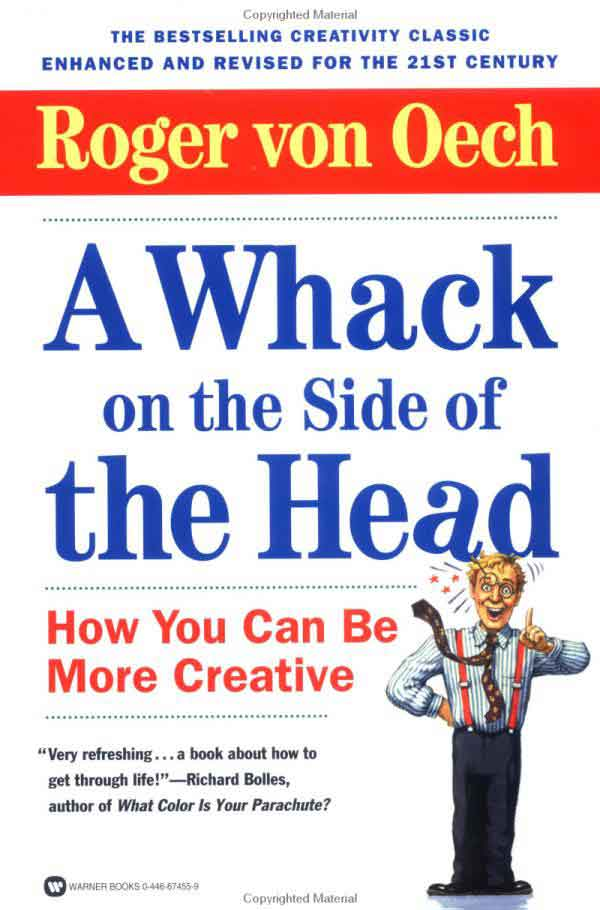

# Creative Think
* Author: Andy Hertzfeld
* Story Date: July 1982
* Topics: Inspiration
* Characters: Alan Kay, Bill Budge
* Summary: A seminar with Alan Kay

 

In July of 1982, while I was in the midst of writing the Control Manager part of the Macintosh toolbox,  my friend Bill Budge invited me to a computer industry seminar called "Creative Think", where interesting people gave purportedly inspiring talks.  It was organized by Roger van Oech, a consultant who had written a book about creativity entitled "A Whack On The Side Of The Head".  I usually avoided both creativity seminars and industry schmooze-fests, but my friend Bill had somehow finagled free tickets and I thought it would be worth it just to see him.

Carver Mead gave an interesting talk on newly emerging VLSI technology, and some old chip industry veterans recounted amusing war stories, but the last talk of the day was the one that mattered to me.  It was given by Alan Kay, the inventor of Smalltalk and the Alto, and the driving force behind Xerox PARC.  I had read about Alan, and been inspired by his article in the September 1977 issue of Scientific American, but I had never seen him before in person or heard much about him.

Alan's speech was revelatory and was perhaps the most inspiring talk that I ever attended. I grew increasingly excited as he made one brilliant, insightful remark after another, and took out my notebook to write as much of it down as I could.  Alan was articulating the values behind the work that I was doing, even though he wasn't aware of it,  in a way that really resonated with me.  After I got back to my office in Cupertino, I transcribed it onto a single page, and copied it to give out to the rest of team.

I still have those notes, so I thought it would be interesting to reproduce them here, as an example of some of the thinking that inspired our efforts.

* * *

**Alan Kay's talk at Creative Think seminar, July 20, 1982**

Outline of talk:  Metaphors, Magnetic Fields, Snobbery and Slogans

The best way to predict the future is to invent it.

Humans like fantasy and sharing:

- Fantasy fulfills a need for a simpler, more controllable world.
- Sharing is important - we're all communication junkies.  We have an incredible bandwidth disparity (easy to take in, hard to give out); our devices have the reciprocal disparity (hard to take in, easy to give out)

Metaphors:

- Computer as medium (like clay or paint)
- Computer as vehicle
- Computer as musical instrument

Magnetic Fields: Find a central metaphor that's so good that everything aligns to it.  Design meetings are no longer necessary, it designs itself.  The metaphor should be crisp and fun.

Smalltalk is object-oriented, but it should have been message oriented.

Snobbery: Turn up your nose at good ideas.  You must work on great ideas, not good ones.

Appreciate mundanity:  after all, a pencil is high technology

One goal:  the computer disappears into the environment

The computer shouldn't act like it knows everything.

The whole notion of 'programming language' is wrong.

Slogans:

- Better is the enemy of best
- Relative judgements have no place in art
- Systems programmers are high priests of a low cult
- Point of view is worth 80 IQ points
- Good ideas don't often scale

Remember, it's all software, it just depends on when you crystallize it.

People who are really serious about software should make their own hardware.

Final advice: content over form, go for fun.