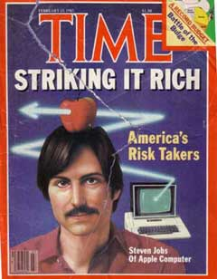

# The Little Kingdom
* Author: Andy Hertzfeld
* Story Date: December 1982
* Topics: The Press, Personality
* Characters: Dan Kottke, Steve Jobs, Jef Raskin, Mike Moritz
* Summary: Steve Jobs was almost 1982's Man of the Year

 

    
The February 15th, 1982 edition of Time magazine featured none other than Steve Jobs on its cover, appearing in an article entitled "Striking It Rich: America's Risk Takers".  Instead of a photograph, Steve was depicted in a drawing with a red apple balanced on his head that was pierced by a zig-zag bolt of light emanating from an Apple II.

The article inside focused on a number of high tech start-ups, but there was a long sidebar that told the story of Apple's meteoric rise, written by a young business reporter named Mike Moritz.   It was a bit critical in places ("As an executive, Jobs has sometimes been petulant and harsh on subordinates"), but in general it was positive about the company and its prospects.

Macintosh development was shrouded in secrecy, even within Apple, so we were surprised one day a few months later when Steve appeared in the software area of Bandley 4 accompanied by the Time reporter, Mike Moritz.  Steve requested that I give him a demo of the Macintosh, and answer all of his questions.  Apparently, Mike wanted to write a book about Apple, and managed to convince Steve to give him total access to the company, including the Macintosh team.

"Mike's going to be our historian," Steve informed us, "so you can tell him everything.  Treat him like he's a member of the team, because he's going to write our story for us."

The previous year, a development team at Data General was immortalized by Tracy Kidder's best selling book, "The Soul of a New Machine", about the ups and downs of developing a new mini-computer.  Now it seemed like Mike Moritz was going to do something similar for the Mac team.

Over the next few months, Mike spent lots of time hanging around the Mac team, attending various meetings and conducting interviews over lunch or dinner, to learn our individual stories.  Mike had grown up in South Wales and attended Oxford before moving to the US for grad school, obtaining an MBA from Wharton.  He was in his mid-twenties, about the same age as most of us, and was very smart, with a sharp, cynical sense of humor, so he fit right in, and seemed to understand what we were trying to accomplish.

In December 1982, word somehow got around that Time Magazine was considering awarding Steve Jobs its prestigious "Man of the Year" designation for 1982.  Mike Moritz, who was by now Time's San Francisco Bureau Chief, came down to Apple for another round of interviews, as background for the lengthy "Man of the Year" story.  But we were in for a surprise when the award was announced the last week of the year.

Instead of crowning Steve Jobs as the Man of the Year as we expected, Time's editorial staff gave the designation to "The Computer", declaring 1982 to be the "year of the computer" and explaining that "it would have been possible to single out as Man of the Year one of the engineers or entrepreneurs who masterminded this technological revolution, but no one person has clearly dominated those turbulent events. More important, such a selection would obscure the main point. TIME's Man of the Year for 1982, the greatest influence for good or evil, is not a man at all. It is a machine: the computer."

The cover story did include another profile of Steve Jobs, containing some comments that were less than complimentary.  One unspecified friend was quoted saying "something is happening to Steve that's sad and not pretty", but the best quote was attributed to Jef Raskin:  "He would have made an excellent King of France."

Steve became quite upset when he read an advance copy of the Time article on New Year's eve, and even called up Dan Kottke and Jef Raskin early on New Year's Day to complain to them about it.   Soon, Mike Moritz was no longer welcome on the Apple campus; in fact, Steve told the software team "if any one of you ever talk to him again, you'll be fired on the spot!"

But some of us talked with Mike again surreptitiously, as he was putting the finishing touches on his book around the time of the Mac introduction.  The book, entitled "The Little Kingdom: The Private Story of Apple Computer", was published in fall of 1984; twenty years later it remains one of the best books about Apple Computer ever written.

Perhaps inspired by the example of Steve Jobs and Apple, Mike Moritz switched careers in 1986 to become a venture capitalist, working for Don Valentine at Sequoia, one of the original investors in Apple.  Mike became the original investor in Yahoo in April 1995, convincing Jerry Yang and David Filo to commercialize their web directory, and today is one of the most respected VCs in the industry.

