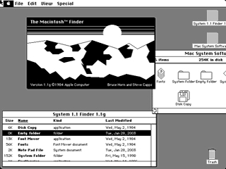

# The Grand Unified Model (2) - The Finder
* Author: Bruce Horn
* Story Date: January 1983
* Topics: Software Design
* Characters: Bruce Horn, Larry Kenyon, Steve Jobs, Frank Ludolph, Steve Capps, Dan Smith, Bill Atkinson, Andy Hertzfeld
* Summary: The evolution of the Finder

 
    
One of the first things I did when I joined the Mac group was to begin working on the Finder.  The first Finder, written in early 1982 with Andy's help, was a simple diskette image with tabs that represented the files on the disk.  (see Early Demos).  This Finder was the first to begin to take advantage of the idea of spatial organization: you could drag the tabs around and place them wherever you wanted on the floppy image.  Also, my experience with Smalltalk showed through: the big "Do It" button was named after the Do It menu item in Smalltalk, which evaluated a selected expression.  This Finder was actually usable, and served as a placeholder until the real Finder was available.

Immediately after the first Finder prototype, I wrote a second which was much more recognizable as the ancestor to the Finder that shipped.  This prototype was a nonfunctional prototype that did not actually read the disk, but instead, read a text file that described a hierarchy of files within folders that would be displayed in windows.  Our filesystem at the time did not have the concept of directories, so I had to fake it with the proof-of-concept prototype.  This was the first Finder that provided double-clicking to open folders, documents, and applications; drag-and-drop to move files between folders; icon and list views; and persistent spatial locations of icons within windows.  Of course, it was all window-dressing and none of it was functional, but it did give a good idea of what we would eventually want to implement.  Unfortunately, it also made it look like the actual Finder implementation would be easy, which it most definitely was not.

Bill Atkinson came by and I gave him a demo.  He had been thinking about the Lisa Filer, which was being written by Dan Smith and Frank Ludolph, and was dissatisfied with its design.  When he saw in our Finder mockup some of the ideas that he had also seen in a MIT project called Dataland, he was convinced, and the IF (Icon Filer) project was born (see Rosing's Rascals).  Bill, Dan and Frank put together a new Filer based on these concepts in time to ship with the first Lisa in 1983.  In the meantime, I was working on the Resource Manager until later that year.

But I still couldn't get started on the Finder until I figured out how to handle files and applications.  We were trying to make the Macintosh a very friendly computer, an information appliance, something that everyone could use.  For example, one of the things that I felt could stand improvement in the current computing experience was the problem of filenames.  In the Finder, I wanted to make it as easy as possible to give meaningful names to files without excessive restrictions placed on them.

At the time (and still, in some cases, now) filenames were very restricted, both in length and in format.   Filenames had to have a three character suffix, with a dot, to denote their file types: text files were named "myfile.txt" and executable applications were named "word.exe".  Filenames were also typically limited to eight characters, not including the suffix; this led to very cryptic naming on other computers, which we definitely wanted to avoid.

We decided that we needed to allow users to name their files whatever they wanted, with any characters, including spaces.  Because the Finder would allow the user to simply click on a particular file to choose it, special characters like spaces would be no problem; in command-line systems, parsing filenames with special characters could be problematic.

The Grand Unified Model provided a framework for solving this problem too.  Since resource objects were typed, indicating their internal data format, and had ID's or names, it seemed that files should be able to be typed in the same way.  There should be no difference between the formats of an independent TEXT file, stored as a standalone file, and  a TEXT resource, stored with other objects in a resource file.  So I decided we should give files the same four-byte type as resources, known as the type code.  Of course, the user should not have to know anything about the file's type; that was the computer's job.  So Larry Kenyon made space in the directory entry for each file for the type code, and the Mac would maintain the name as a completely independent piece of information.

Simply storing the file type in the directory was not enough, however.  There might be many different applications that could open files of a given type (say, a text file); how would the Mac know that a text file called "My Resume" needed to be opened in MacWrite, and another text file called "Marketing Plan" needed to be opened in WriteNow?  Just knowing the file's type wasn't enough; the Finder also had to know which program created the file, and thus would be the best choice to open it.   Thus another four-byte "creator code" would also be maintained, which would tell the Finder which program needed to be launched to open a particular document.  For convenience, the user could also easily override this default, by dragging the document to whichever application he would like.

Finally, we also wanted to have useful and meaningful icons for programs and documents on the Mac.  Using the type and creator mechanism, this was easy; we would just associate a specific icon for each file type that is handled by a particular application.  Given a (type, creator) pair, it would be easy to look up the appropriate icon to draw for the file.

But where would these icons come from, and where would they be stored?  It seemed clear that each program would be responsible for defining icons for the application and its documents, and that this information should be stored in the application itself; but if we simply opened the application's file each time we needed to draw an icon, the Finder would be terribly slow.  I decided that the Finder needed to cache these icons and associations in a resource file.  This was the Desktop Database.

**The Desktop Database**

Programmers reading Macintosh technotes on the Resource Manager would run across the statement that "The Resource Manager Is Not A Database!"  This is ironic, because one of the very first uses of the Resource Manager was in fact for a database: the Desktop Database, which stored and maintained information relating to applications, documents, and their respective icons.

Applications would include a set of resources with known ID's in their resource map; this group of resources would collectively be called the application's Bundle, and it would have the type BNDL.  In the bundle were special FREF resources (file references) that would map a document or application type to an icon ID.

When the Finder would encounter an application on a disk, it would look into the Desktop Database to detemine whether it had already seen this application and copied its bundle.  If not, it would copy the bundle and associated icon and FREF resources, and reassign the ID's of the icons so that they would be unique within the database.  The FREF resource provided an indirect ID mapping to make this possible.  In this way, all bundles could be readdressed within the database and there would be no conflict between the different resources pulled in from a variety of applications.

Drawing the image of a particular document was then a simple matter of looking up the appropriate icon  by type and creator in the Desktop Database, and loading the resource.  On the 400K disk, this worked very well--the Resource Manager was up to the task, and it wouldn't show its limitations for several years--an eternity in the software world.

**The Final Push**

By late 1982, the Lisa Filer was nearly finished.  At 360K, it was a significant application--much too large for us to use, and it wasn't based on the Grand Unified Model of types, creators, and resources.  Although Bill offered us the code to the Filer, we always knew that we'd be writing our Finder from scratch.

The Mac was to ship in January, 1984, our final drop dead date.  In late 1983 it became clear that I needed help to finish it in time, and Steve Capps was recruited to work with me on the Finder (see Steve Capps Day).  Also by this time, reporters, writers, and associated VIPs were being escorted through the Mac Group to see our new machine, and to talk with Andy, Steve Jobs, and some of the other folks on the team.  Capps and I had too much work to do to be distracted by the reporters, so we moved to a separate office in a different building.

Writing the Finder was not easy.  Because of the tight memory requirements, most of the code was 68K assembly, like the ROM Toolbox.  Capps took on some of the more difficult tasks, including file copying (see Disk Swapper's Elbow).  We worked late into the night, listening to Violent Femmes and Capps' other punk rock recordings.  The clock was ticking.

Capps and I ended up finishing version 1.0 of the Finder in time for the Mac to be introduced on January 24 (see Real Artists Ship).  It weighed in at 46K bytes, approximately 1/8th the size of the Lisa Filer.  The small size of the Finder made it possible to have the entire System and Finder, plus an application, plus a few documents, on a single 400K floppy...just barely.  We were overjoyed, but exhausted.  The Grand Unified Model --resources, types and creators, the Desktop Database, and the Finder-- was finally done.