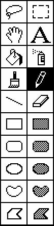
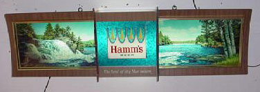

# MacPaint Evolution
* Author: Andy Hertzfeld
* Story Date: June 1983
* Topics: MacPaint, Software Design, QuickDraw, Technical, Lisa
* Characters: Steve Jobs, Bill Atkinson, Rod Perkins
* Summary: Bill decides to leave out a very impressive feature

 
    
While Bill Atkinson was developing LisaGraf, the crucial, lightning fast graphics package that was the foundation of both the Lisa and Macintosh user interface (it was renamed QuickDraw for the Mac), he also worked sporadically on a simple bitmap-based drawing program for the Lisa called SketchPad.  SketchPad enabled mouse-based drawing with a selection of paintbrushes and patterns, and gave Bill a quick way to test out and show off new features or improvements as they were added to LisaGraf.

In early 1983, soon after the Lisa was announced at the 1983 annual shareholders meeting, Bill switched from working on Lisa system software to writing a killer graphics application for the Macintosh.  Steve Jobs thought that he should work on a structured drawing program, something like Mark Cutter's LisaDraw, but Bill thought that structured drawing was too complex, and wanted to create something that was simple, elegant and fun to use.

He began by dusting off his old SketchPad code, and getting it running on the Mac as MacSketch.  SketchPad used menus to select patterns and styles to draw with, but Bill replaced them with permanent palettes at the bottom of the screen and added another large, prominent palette on the left, containing a variety of drawing tools.  More tools would be added over time, but the basic structure of MacPaint was there from its earliest stages.

The first big advance that Bill worked on was eliminating flicker. As you dragged a shape or image across the screen, it had to be erased from its old position before being drawn in the new one, which caused a distracting flicker as the video sometimes displayed interim, partially rendered states.  Bill completely eliminated flicker by composing everything in an offscreen memory buffer, which was transferred to the screen in one fell swoop, so the interim states were never visible.

In fact, despite the Macintosh's limited memory, he used two offscreen buffers, each the size of the document window, with one containing the current pixels of the document, and the other containing the pixels of its previous state, before the most recent operation.  This made it very easy to implement undo, by just copying the old buffer to the new.  It also enabled fast drawing, because it was very easy to access the original state of the document in the second buffer as an object was being modified.

After getting basic updating working well, Bill began to add more tools to the palette.  He added a rectangular selection tool, to allow the user to perform operations on a subset of the document.  The selection rectangle was depicted by inverting the pixels beneath it, which worked well enough over solid areas, but was confusing and hard to see when the underlying image was complex, like a digitized picture.  Bill knew he had to find a better way to do it.

He was thinking about the selection problem one evening when he went to dinner at an old beer and hamburger joint in Los Gatos, the kind of place where decades worth of initials are carved into the wooden tables.  He ordered a beer, looked around the bar, and noticed a Hamm's beer sign. The beer sign featured an impressive animated waterfall, with the water seeming to flow down the waterfall into the lake. Bill figured out the animation was accomplished by a mask layer moving beneath the surface of the sign that varied which portion of the image was visible below.it.

He suddenly realized that an animated border, animated with a technique similar to the waterfall, could solve the graphical selection problem because it would always be easy to spot no matter what the background. He raced back home and implemented the animation by using an alternating sequence of patterns that produced the illusion of continuous motion, just like the beer sign.  It looked great, but he didn't know how to refer to it.  A couple of days later, he showed it to Rod Perkins on the Lisa applications team, who told Bill the effect resembled "marching ants," which Bill liked, so that's what he called it.

Around April 1983, Bill changed the name of the program from MacSketch to MacPaint.  He began to hit his stride, and started to add new features to MacPaint on a daily basis.  One of the most important was "Fat Bits", a mode which magnified a small section of the document by a factor of 8, allowing the user to easily manipulate individual pixels.  It was implemented by scaling the offscreen buffer as it was transferred to the screen, so all of the other tools and effects kept working in Fat Bits mode.

Another key improvement came when Bill implemented the paint bucket tool, which allowed the user to fill an entire area of the screen with the selected pattern with a single click.  It used a "seed fill" algorithm to find all the neighboring pixels of the matching color, which was difficult to implement because of our stringent memory constraints.  Bill ended up implementing a few different seed fill algorithms before he settled on one that was both fast and memory efficient enough.  The seed fill routine eventually migrated from MacPaint into QuickDraw as part of the 128K ROM.

Rectangular selection was useful, but often you needed to manipulate an arbitrarily shaped area of an image, so Bill came up with another selection tool he called the "lasso", because it contracted around its target.  It's hard to control the mouse with pixel-level precision, so the lasso tool allowed you to roughly outline the area of interest, and it would automatically tighten, skipping white pixels to cinch tightly around the target.  The lasso sort of fell out of doing the paint bucket, since the seed fill routine was exactly what was needed to cinch the lasso properly.

The lasso allowed an arbitrary area of pixels to be selected, so it required a third offscreen buffer the size of the document window, that contained a mask to indicate which pixels were part of the selection.  The mask buffer allowed fast graphical operations on large, irregular areas, such as dragging an image around the screen, or making the lasso selection shimmer with the marching ants effect.  The first two offscreen buffers were allocated statically, but the mask buffer needed to be deallocated when it wasn't being used, so its memory could be used for other purposes.

MacPaint was good at drawing text, allowing the user to specify characters at any position, with any font, size or style.  But once the text was instantiated, it just became pixels like everything else; you couldn't go back and edit it as text. In June 1983, Bill thought he could do something about that.

Bill decided to try to turn pixels back into characters when you selected them with the text tool.  He wrote a lot of elaborate code, probably as much as for any other MacPaint feature.  First, he wrote assembly language routines to isolate the bounding box of each character in the selected range.  Then he computed a checksum of the pixels within each bounding box, and compared them to a pre-computed table that was made for each known font, only having to perform the full, detailed comparison if the checksum matched.

Bill got his character recognition routines working well, and it seemed like magic, if you were used to the earlier MacPaint, to be able to recover and edit previously placed text. It wasn't perfect, because it would fail to recognize a character if a single dot was out of place, but it was still very useful.  Everyone loved the feature, and congratulated Bill for pulling off another miracle.

I was surprised a few days later when Bill told me that he decided to remove the character recognition feature from MacPaint.  He was afraid that if he left it in, people would actually use it a lot, and MacPaint would be regarded as an inadequate word processor instead of a great drawing program.  It was probably the right decision, although I didn't think so at the time.  I was amazed that he was able to detach himself from all the effort that he put into creating the discarded feature; I know that I probably wouldn't have been able to do the same.

MacPaint was essentially finished by October 1983, long before our other key applications.  The last part of finishing MacPaint involved dealing with out of memory problems, since it was really pushing the limits of the 128K Macintosh by using the three, large offscreen buffers.  At the worst case, there was only about 100 bytes free in MacPaint's heap.   Most of the bugs we encountered when running MacPaint turned out to be bugs in the underlying system, which were exposed by running so close to the edge of available memory.

It's interesting to note that MacPaint was a rather small program by today's standards, but I guess that it had to be to run in the Mac's one eighth of a megabyte of memory.  The finished MacPaint consisted of 5,804 lines of Pascal code, augmented by another 2,738 lines of assembly language, which compiled into less than .05 megabytes of executable code.