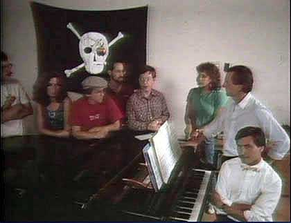

# Pirate Flag
* Author: Andy Hertzfeld
* Story Date: August 1983
* Topics: Apple Spirit, Buildings, Lisa Rivalry, Retreats
* Characters: Steve Capps, Susan Kare, Steve Jobs
* Summary: The Mac Team hoists a pirate flag

 
    
The Mac team held another off-site retreat in Carmel in January 1983, just after the Lisa introduction (see Credit Where Due).  Steve Jobs began the retreat with three "Sayings from Chairman Jobs", intended to inspire the team and set the tone for the meeting.   The sayings were:

1.  Real artists ship.
2.  It's better to be a pirate than join the navy.
3.  Mac in a book by 1986.

I think the "pirates" remark addressed the feeling among some of the earlier team members that the Mac group was getting too large and bureaucratic. We had started out as a rebellious skunkworks, much like Apple itself, and Steve wanted us to preserve our original spirit even as we were growing more like the Navy every day.

In fact, we were growing so fast that we needed to move again.  In August of 1983, we moved across the street to a larger building that was unimaginatively designated "Bandley 3".  I had worked there before, in 1980, when Apple had initially built it to house the original engineering organization.  But now it was to be the new home of the newly christened "Macintosh Division", over 80 employees strong.

The building looked pretty much like every other Apple building, so we wanted to do something to make it look like we belonged there. Steve Capps, the heroic programmer who had switched over from the Lisa team just in time for the January retreat, had a flash of inspiration: if the Mac team was a band of pirates, the building should fly a pirate flag.

A few days before we moved into the new building, Capps bought some black cloth and sewed it into a flag. He asked Susan Kare to paint a big skull and crossbones in white at the center.   The final touch was the requisite eye-patch, rendered by a large, rainbow-colored Apple logo decal.  We wanted to have the flag flying over the building early Monday morning, the first day of occupancy, so the plan was to install it late Sunday evening.

Capps had already made a few exploratory forays onto the roof during the weekend while a few of us looked out for guards on the ground.  At first, he thought he could just drape the flag on the roof, but that proved impractical as it was too hard to see, especially when the wind curled it up.  After a bit of searching, he found a thin metal pole among the remaining construction materials still scattered inside the building, that was suitable to serve as a flag pole.

Finally, on Sunday night around 10pm, it was time to hoist the Jolly Roger.  Capps climbed onto the roof while we stood guard below.  He wasn't sure how he would attach the flag, and didn't have many tools with him.  He scoured the surface of the roof and found three or four long, rusty nails, which he was able to use to secure the flag pole to a groove in the roof, ready to greet the Mac team members as they entered the new building the next morning.

We weren't sure how everyone would react to the flag, especially Steve Jobs, but Steve and almost everyone else loved it, so it became a permanent fixture of the building.  It usually made me smile when I caught a glimpse of it as I came to work in the morning.

The flag waved proudly over Bandley 3 for about a month or two, but one morning in late September or early October, I noticed that it was gone.  It turns out that the Lisa team, with whom we had a mostly friendly rivalry, decided it would be fun to steal the flag for themselves.  I think they sent us a ransom note or something, so a few of us stormed over to the Lisa building to retrieve it, which we accomplished, although Capps had to wrestle it from the grasp of one of the secretaries, who was hiding it in her desk.

The flag continued to fly over Bandley 3 for more than a year.  I think it was even photographed for a magazine or two during the Mac introduction.  But suddenly one day it was missing again, and I'm not sure if anyone knows what happened to it.  It would be a great artifact for the Computer History Museum if it ever turns up.