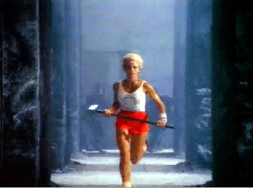
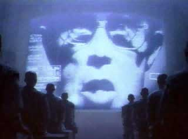

# 1984
* Author: Andy Hertzfeld
* Story Date: September 1983
* Topics: Marketing, The Launch
* Characters: Regis McKenna, Steve Hayden, Mike Murray, Steve Jobs, John Sculley, Mike Markkula, Burrell Smith, Andy Hertzfeld, Lee Clow, Jay Chiat, Brent Thomas
* Summary: The famous 1984 commercial almost got canceled

 
    
From the very beginning, Apple always had a flair for marketing.  Mike Markkula believed that a fledgling venture needed to act like a successful company if it wanted to become one, at least in terms of external perception, and Steve Jobs always insisted on the highest possible production values, even while Apple was still in the garage.  The Apple II was featured in an expensive, two page spread in the September 1977 issue of Scientific American, for example, even though Apple had less than twenty employees and minimal sales at the time.

Apple's advertising agency was Chiat-Day, founded by Jay Chiat in 1968. Jay Chiat was compulsively innovative, brash and irreverent, much like an older version of Steve Jobs, and the two hit it off great when they were introduced in 1981, just before Chiat-Day acquired Regis McKenna's advertising operations.   Jay and his talented team, featuring Creative Director Lee Clow and star copywriter Steve Hayden, crafted Apple's first TV commercials, recruiting talk show host Dick Cavett as a spokesperson, and created the campaign that launched the Lisa, including a TV commercial that starred Kevin Costner while he was still unknown.

Toward the end of 1982, art director Brent Thomas and Steve Hayden came up with the idea of doing an ad campaign based on the timely tagline "Why 1984 won't be like 1984". Chiat-Day shopped it around to a number of clients, including Apple, where it was proposed to be used for a print ad in the Wall Street Journal promoting the Apple II.  But Apple didn't go for it, and the idea was filed away until the spring of 1983, when they met with the Mac marketing team to start working on the launch, which was scheduled for January 1984.

Steve Jobs wanted to launch the Macintosh with an inspiring commercial that was as revolutionary as the product itself.  He loved the Orwellian tagline when it was presented, and he encouraged the Chiat-Day team to pursue it.  Steve Hayden and Brent Thomas put together an intriguing story board, envisioning a visually striking, highly symbolic, miniature science fiction epic featuring a young female athlete who liberates the subjugated masses from totalitarian domination by throwing her sledgehammer to smash a huge screen displaying Big Brother.

Macintosh marketing manager Mike Murray and Steve Jobs loved it, but they needed to get new CEO John Sculley's approval for such a large expenditure.  Sculley was a bit apprehensive (after all, the commercial hardly mentioned the Macintosh), but he gave his OK for an unprecedented production budget of over $750,000, to make the one-minute commercial.

Chiat-Day hired the best science fiction oriented director they could find, Ridley Scott, whose previous movie, Blade Runner, possessed the visionary dystopian feel they were striving for.  Ridley was based in London, so they decided to shoot it there, at Shepperton Studios.  Several Apple and Chiat Day executives, including Mike Murray and Steve Jobs, travelled to London for the week of filming.

By the time the Apple folks arrived, Ridley's team had assembled a cast of almost 200.  To play the oppressed, downtrodden baldheaded workers, his people recruited dozens of authentic British skinheads, paying them $125 dollars a day to participate.  It was harder to cast the young heroine, since most of the models who tried out had trouble spinning with the heavy sledgehammer.  Luckily, one named Anya Major was an accomplished discus thrower, and she could do it faultlessly, so she got the part.

When he arrived at the studio, Mike Murray went looking for Jay Chiat, who was supposed to already be there.  He found him lurking off to one side, seemingly hiding behind some scenery.  Apparently, some of the skinheads were in a nasty mood, and they were looking for trouble during breaks in the filming, so Jay thought it was prudent to make sure he stayed out of their way.

While the filming was taking place in London, I got a call from someone at Chiat-Day asking if I could write an Apple II Basic program to flash impressive looking numbers and graphs on the screen, to be overlayed on the image of Big Brother.  I spent an afternoon cooking something up, and I sent it off to them, although I was never sure if it was used or not.

Lee Clow and Steve Hayden presented a rough cut of the commercial to the Apple team a few weeks later, and everyone was ecstatic.  The commercial was classy, suspenseful and enigmatic, and seemed certain to garner lots of attention.   It was shown for the first time at Apple's 1983 annual sales conference in Honolulu in October, with Steve preceding it with a clever rap positioning Apple as the industry's last alternative to IBM (see The Times They Are A-Changin'), to a rapturous reception, almost as apocalyptic as the commercial itself.  The response was so great that Apple booked two expensive slots, for sixty seconds and thirty seconds, costing over a million dollars, to show it during Super Bowl XVIII, which was just two days before the Mac introduction.

Mike Murray and Steve Jobs screened the commercial for Apple's board of directors in December, to get final approval for the huge Superbowl expenditure.   To their surprise, every outside board member seemed to despise the commercial, with Mike Markkula suggesting that Apple begin a hunt for a new ad agency.  One of the board members remarked that it was the worst commercial that he had ever seen.  Steve and Mike were devastated.

The chilling reception from the board compelled John Sculley to ask Chiat-Day to sell back both time slots that they had purchased.   But Jay Chiat was true to form, and only sold off the thirty second slot, telling Apple that he wasn't able to get rid of the longer one at so late a date.  Apple considered using the slot for a more conventional commercial, but in the end decided to take a chance on the 1984 spot.

The Mac team was told that the commercial would air early in the third quarter, at the first commercial break after the second half kick-off.  Burrell and I wanted to see a real audience's reaction to the commercial more than the commercial itself (since we had already seen it plenty of times), so we watched the Superbowl at a sports bar near Stanford called the Oasis, with some other Mac team friends.  The game was boring, but the bar was packed, and the commercial looked great when it aired at the designated time.  We thought we heard a small murmur in the bar after the commercial, but it was hard to tell if there was any significant reaction.

That evening, we were surprised to see the commercial run again on the evening news shows.  Apparently, it made such a big impression on lots of viewers that, coupled with the fact that it only was supposed to run once, it became a news item itself, as well as increasing expectations for the upcoming launch.  It ran dozens of times on news shows in the next couple of days, gathering Apple over five million dollars worth of free publicity.

A week after the Macintosh launch, Apple held its January board meeting.  The Macintosh executive staff was invited to attend, not knowing what to expect.  When the Mac people entered the room, everyone on the board rose and gave them a standing ovation, acknowledging that they were wrong about the commercial and congratulating the team for pulling off a fantastic launch.

Chiat-Day wanted the commercial to qualify for upcoming advertising awards, so they ran it once at 1 AM at a small television station in Twin Falls, Idaho, KMVT, on December 15, 1983.  And sure enough it won just about every possible award, including best commercial of the decade.  Twenty years later it's considered one of the most memorable television commercials ever made.