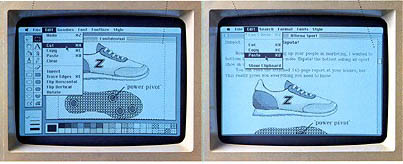

# Cut, Paste and Crash
* Author: Andy Hertzfeld
* Story Date: September 1983
* Topics: Technical, Software Design, Bugs
* Characters: Larry Kenyon, Susan Kare, Andy Hertzfeld
* Summary: We uncover a particularly bad bug shortly after ROM freeze

 
    
One of the last parts of the Macintosh system software to be finished before freezing the ROM in September 1983 was the "clipboard manager", which was the code responsible for facilitating cutting and pasting information between applications.   The clipboard manager provided some simple calls to access and manipulate the "clipboard", a memory buffer that held the last piece of data that was cut or copied.  The trickiest part of the clipboard manager was the way it managed memory when the user quit an application.

The clipboard buffer was typically kept in the primary memory area that was available to an application, known as the "application heap".  But when an application terminated, its application heap was deallocated, before a brand new heap was allocated for the incoming application.   The clipboard manager had to take special measures to preserve the clipboard during this interregnum, when no application heap was available to hold it.

The first thing we thought of was to write the clipboard to disk while we were between applications, which worked but was problematic because the Macintosh didn't have a fixed disk, so there might not be a floppy in the drive, or perhaps it was write protected.  We also tried to copy the clipboard into the system heap, which persisted between applications, but the clipboard was often too big to fit there.  Ultimately, we solved the problem by copying the clipboard to the stack, which was a large area in high memory used to hold application variables and run-time state like return addresses,  where it stayed until it was moved into the application heap of the newly launched application.

A few weeks after the ROM was frozen, Apple put together a sales "roll-out" presentation to introduce the sales team to all things Macintosh, in order to prepare them to start selling the machine a few months later.  There was lots of the usual sales hoopla, but the clear highlight of the event was the first-person training on the machine itself, where each salesperson would get to try out a Macintosh for the first time.  A teacher guided them through a simple demo which let them learn to use the mouse and then try out MacWrite, MacPaint and the Finder.  

The climax of the demo had them loading a MacPaint document, selecting an area and copying it to the clipboard, and then launching MacWrite and pasting the image into a MacWrite document, easily mixing text and graphics, which was very impressive back in those days.  Susan Kare had drawn a terrific, detailed rendering of a sneaker for the Macintosh brochure, which was used as the graphic for the demo.  They were supposed to select and copy the sneaker and then paste it into MacWrite.

I was invited to go to the sales presentation, but I couldn't,  because I was still working frantically with the rest of the software team to finish the software in time to ship the following January.  I was busy working in the afternoon when I received a panicked phone call from one of the sales guys involved with the presentation.

"We've got a problem!", he told me. "The sneaker demo is crashing.  Not all the time, though, sometimes it works and sometimes it doesn't.  It's impossible to predict when it will happen, but when it does, the crash is really bad - as soon as you quit MacPaint, the screen goes crazy and then it reboots.  We're going to have to stop doing the cut and paste part of the demo unless you get us a fix soon."

I got off the phone and thought about it.  I was describing the problem to someone when I suddenly stopped in mid-sentence, because I realized what was going on.  After quitting the application, the clipboard manager would copy the clipboard to the stack.   It subtracted the size of the clipboard from the stack pointer, and then moved the memory into the allocated space.  I realized that around half of the time, the size of the clipboard would be an odd number, which would end up setting the stack pointer to an odd number, which was a perversely horrible thing to do.  The Mac's 68000 microprocessor couldn't fetch memory from an odd address; it generated an error if you tried.  But the stack is used for the basic operation of the processor, including error handling.  An odd stack pointer would essentially drive the 68000 crazy, recursively faulting as it tried to handle exceptions.  It worked around half of the time because statistically the clipboard size would be an even number around half of the time.  But the other half would cause the flamboyant crash that was being described.

Once I understood what was going on, it was easy to fix by rounding up the clipboard size to an even number.  Unfortunately, the errant code in question was in ROM, which was already frozen in immutable silicon.  This was the first major bug that I knew of in the ROM and I wondered if we were going to have to spin another version.  But Larry Kenyon had already figured out a sneaky technique to fix ROM bugs, by patching system traps.  We had always figured to replace entire buggy system calls in that fashion, but Larry thought of a finer grain way to do it, by patching the first trap called before or after the problem area.  Basically, we could grab control any time the system was invoked, and then add code to fix problems.  I used Larry's technique to devise a patch that fixed the odd stack problem, and then he helped me incorporate it into the System file, so it was loaded when the system booted.

We made a floppy containing the new System file, which was flown out to the sales presentation with a sales manager who was leaving the next day.  But it took a while for the fixed System to proliferate to everyone, so for the next few weeks I had to brace myself every time that I saw someone about to cut and paste between applications.