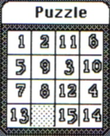

# The Puzzle
* Author: Andy Hertzfeld
* Story Date: September 1983
* Topics: Software Design, Management
* Characters: Andy Hertzfeld, Jerome Coonen
* Summary: The puzzle desk accessory became controversial.

 
    
The original Macintosh could only run one real application at a time, but it could also concurrently run little programs called "desk accessories" that shared memory with the main application.  Like the system itself, most of the desk accessories were written in 68000 assembly language, but in the fall of 1982, I decided to write one in Pascal as a proof of concept and to show developers how to do it, by writing a tiny adaptor that the Pascal code linked with.

Desk accessories were usually utilities, like the calculator or the alarm clock, but I thought that we should also have a game or two, to show that the Macintosh was fun, too.  I decided to write a "15 number puzzle", where there are fifteen numbered tiles in a four by four space that must be arranged in sequential order.  If you click on a tile next to the empty space, it slides into that space.   It was a fun way to waste time and build up your mouse coordination.

Since the number puzzle was written in Pascal, it had to link with the Pascal run-time, which dragged in lots of extra code that wasn't used.  This made the Puzzle over 6K bytes long, even though most of it was just the run-time.

By the fall of 1983, it was time to make decisions about what to include in the shipping product.  We had shown the Mac to a number of industry analysts, and while most were enthusiastic, some didn't really get the graphical user interface and thought it was "game-like", not suitable for serious computing.   This made some of the Macintosh marketing folks a bit leery about the more whimsical aspects of the design, and the puzzle, being an actual game, became somewhat controversial.

Jerome Coonen, the software manager, came by my cubicle one morning to tell me that they decided not to ship the puzzle, partially because of the game-like perception, but mostly because it was just too big.  Applications were very tight on RAM, and the puzzle was one of the biggest desk accessories because it was written in Pascal. At over 6K bytes, it also ate into the available disk space.

I liked the puzzle and I didn't want to capitulate to the buttoned-down, all business view of the customer, so I told Jerome, "You know, the puzzle doesn't have to be so big.  I bet I could rewrite it and get it to take up less than 1K bytes.  Would you keep it if I got it that small, or is it really the other issue?"

Jerome thought about it, and then told me if I could get it down to 600 bytes or so, it would be in the release.  The only problem was I had to get it done over the weekend, because they had to send the manuals out to the printer soon, and there was plenty of other stuff for me to work on.

Of course, I couldn't resist a challenge like that.  It only took a few hours on Saturday to recode it in assembly language, and get it down to the required 600 bytes, since it no longer had to link with the bulky Pascal code.  I proudly showed it off to everyone on Monday, and it did make it into the first release, and stayed there for many years, although it was completely rewritten a couple of times, for various reasons.