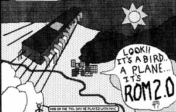

# We're Not Hackers!
* Author: Andy Hertzfeld
* Story Date: September 1983
* Topics: Software Design, Technical, Personality
* Characters: Larry Kenyon, Andy Hertzfeld, Bill Atkinson, Burrell Smith, Steve Capps
* Summary: We were always dealing with memory limitations

 

    
From the beginning, the Macintosh was conceived to be a very low cost, high volume personal computer.  It was important for the design team to keep manufacturing costs as low as possible.  Since memory was relatively expensive, we were always dealing with memory limitations.

One of the most clever parts of Burrell Smith's original, 68000-based digital board was the "bus transformer" logic that multiplexed the data bus, allowing him to hook up the 68000, which demanded a 16 bit data bus, to only 8 memory chips.  He also included a single, byte-wide 64kbit ROM chip, so that first Macintosh, circa January 1981, had a total of 64K bytes of RAM and 8K bytes of ROM.

But as we started to get some software going on the prototype, it became increasingly clear that we didn't have enough RAM for the kind of graphic intensive applications that we wanted to build; after all, just the frame buffer for the bit-map display took up almost one third of the available memory.  And furthermore, Bill Atkinson's graphics routines alone had recently exceeded the size of the 8K ROM.  So, when the digital board was redesigned to incorporate the SCC chip in June 1981, Burrell added another row of 8 memory chips, doubling the RAM size to 128K, and added another ROM chip as well, doubling the ROM size to 16K.  We vowed that we would fight hard to keep that the last increase (in contrast with the Lisa, whose memory requirement's were growing considerably faster than Moore's Law)

Even though the ROM size doubled to 16K, that was barely enough to contain our prototype environment if we included the graphics routines.  Burrell figured he could add a third ROM chip, for 24K total.  Two of the ROM chips were hooked up directly to the 68000's 16-bit bus, so code could run faster, while the third chip shared the "bus transformer" circuit with the RAMs.

We built 50 Mac prototypes in the fall of 1981, each containing 24K of ROM, burned into EPROM.  Although the system fit readily in 24K, we were still worried that soon it would be an unbearably tight squeeze.  Burrell never liked the inelegance of three different ROMs, either.

One day, in early 1982, Burrell returned from a meeting with a semiconductor company's sales representative really excited, almost running into my office.   "OK, you say that you won't be able to fit in 24K, right?  Be honest - how much will we really need?"

We always seemed to need just a little more ROM that we had available.  "I think we'd definitely make it if we had 32K", I responded.

Burrell laughed.  "No you won't.  It's clear that won't be enough, since the software isn't close to being finished yet.  But I just heard that the 256Kbit ROMs are really close, and they'll be ready if we ship in early 1983.  So I can use two 256Kbit chips, connected up to the 16-bit bus, and we'll have 64K bytes of ROM.  64K!  ROM is half the price per bit of RAM, so it makes sense to use as much as we can.  I know you'll be asking for even more someday, but that should keep you busy for a while."

At first, 64Kbytes seemed boundless.  We were already trying to write as tight code as we could, and it seemed like it would be plenty, since we weren't even using 32K yet.   But sure enough, as the system came together in the spring of 1983, we were beginning to strain against the size limit.

Fortunately, we had started to use the resource manager to load objects like fonts and drivers, so we had some flexibility about keeping stuff on disk instead of the ROM.  Jerome and I designed the "PACK" mechanism, where the resource manager would load code for optional packages, like the floating point routines.  But code on floppy disk is much slower to load, and it also would reduce the effective size of each disk.

Even though we tried to make our code as small as possible initially, the lack of space in the ROM made us work even harder to reduce the footprint.  We developed a number of unusual space saving techniques, some of which were inspired by tricks Woz used in the Apple II ROM.  For example, we'd often push parameters on the stack out of order, sometimes four times in a row, because we had a value in a register that we would need later, and we didn't want to fetch it again.  We knew this made the code harder to maintain, but we thought it was worth it.

As ROM freeze time approached, the entire team started to focus on code compression, to get as much code to fit in the ROM as possible.  We had a few practice sessions, where everyone explained their favorite space saving techniques, and then we all plowed through the code, saving a dozen bytes here and there.  Steve Capps, as usual, came up with a good one by developing a simple way of compressing the four or five icons that were built into the ROM, saving hundreds of precious bytes in the process.

Bill Atkinson didn't participate in the code crunching marathon, and wouldn't allow QuickDraw to be subjected to it, except in a few cases, because he believed that all code should be as simple and clear as possible, and thought, probably correctly, that we'd be better off without the tricks in the long run.  Just before the ROM was frozen, in September 1983, he found a bug in the memory manager, that we devised a simple fix for.

I went with Bill to Larry Kenyon's cubicle, where he was maintaining the memory manager sources.  Bill looked over our shoulders as we added a little code to correct the bug.  But he objected when he noticed that we used one of our coding tricks (I'll explain the exact issue in a comment below) while making the fix, and began to get upset.

"Hey, that's not the right way to code. What are you guys, a bunch of hackers?  I'm not sure that I want to work with a bunch of hackers."

Both Larry and I cared more about pleasing Bill than saving every possible byte or cycle, so we changed our fix to use the slower, more conservative, Bill-approved technique.  We also added a comment to the instruction in the source code, to remind us why we did it the slower way in this circumstance.  The comment said "We're Not Hackers!".

