# MacPaint Gallery
* Author: Andy Hertzfeld
* Story Date: October 1983
* Topics: Social Life, Testing, MacPaint, Marketing
* Characters: Susan Kare, Bill Atkinson, Larry Kenyon, Jerome Coonen, Steve Jobs, Patti King
* Summary: A gallery of Susan Kare's MacPaint art from 1983

Bill Atkinson began writing MacPaint in February 1983, just after Susan Kare joined the Mac team to design bitmaps for fonts and icons.   Susan became one of the first and most accomplished users of MacPaint, trying out new features as they were developed and using it for a wide range of practical applications.

Susan kept a notebook of many of the MacPaint documents that she created as the Mac team struggled to finish the Macintosh throughout 1983.  They provide an interesting glimpse of the daily life of the Mac team during that period.  I'm pleased to be able to present scans her beautiful drawings here as part of Macintosh Folklore.

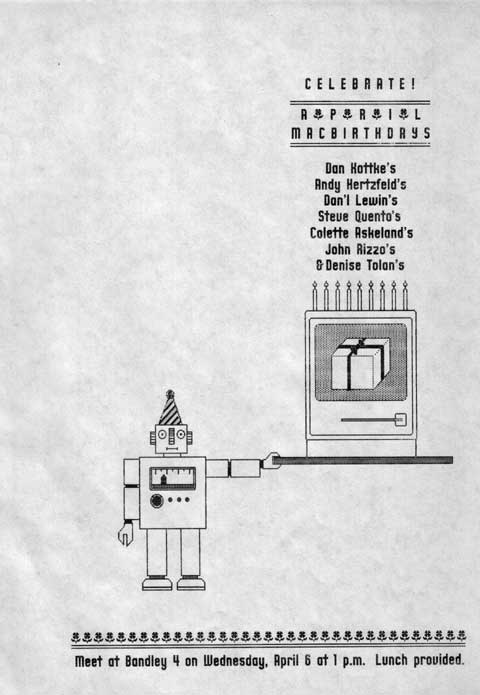

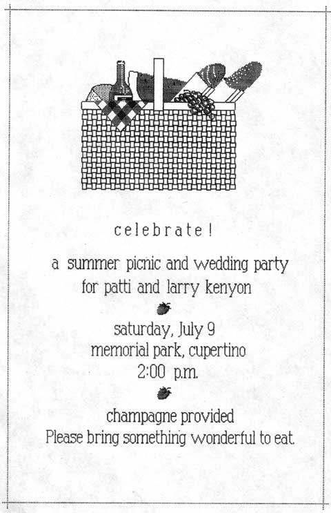

The image on the left is an announcement of a combined birthday party for seven Mac team members whose birthday was in early April, including myself, who was terrified of turning 30 at the time.  As a birthday gift, Susan made a jersey for me with a large hexadecimal number "1E"  (which is 30 in base 16) on it, so I could still say I was a teenager, at least in hexadecimal.

The image on the right is for picnic held in July to celebrate the wedding of two members of the software team: programmer Larry Kenyon and librarian Patti King.  Larry and Patti actually eloped in June; the picnic happened after they returned from their honeymoon.

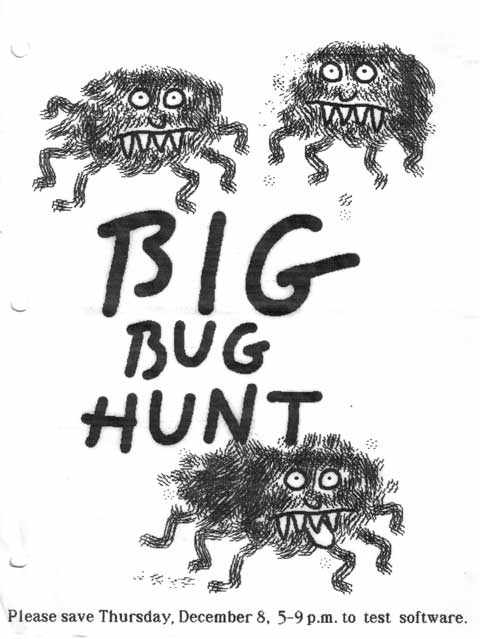

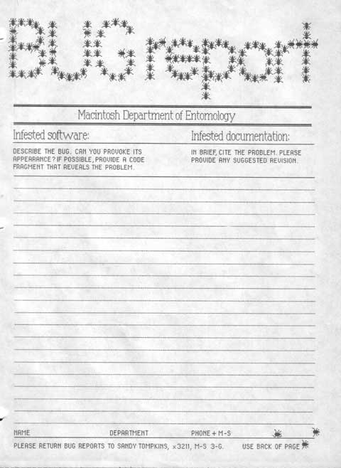

One  of the most important activities during the last couple of months before shipping was software testing.  We held some testing marathons, where the software team enticed employees from the rest of the division to stay late and help test the software by bribing them with dinner (see 90 Hours A Week And Loving It!).  The image on the left is an announcement of another bug hunt, and the one on the right is a bug report form that was used during the testing.

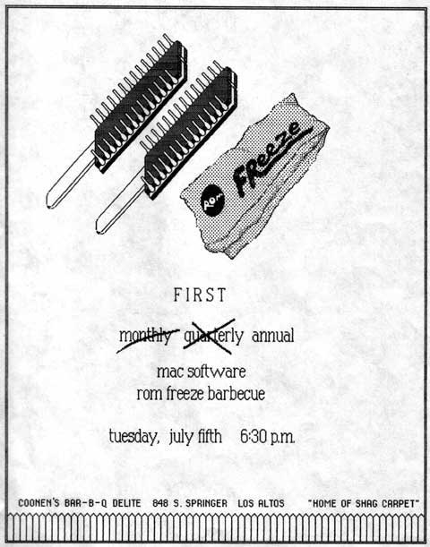

Here is an invitation to celebrate a ROM freeze at software manager Jerome Coonen's house.  This wasn't the final ROM freeze, which took place in September, but the first of a series that led up to it.  We had a party celebrating the final ROM freeze at Woz's house in Scott's Valley.

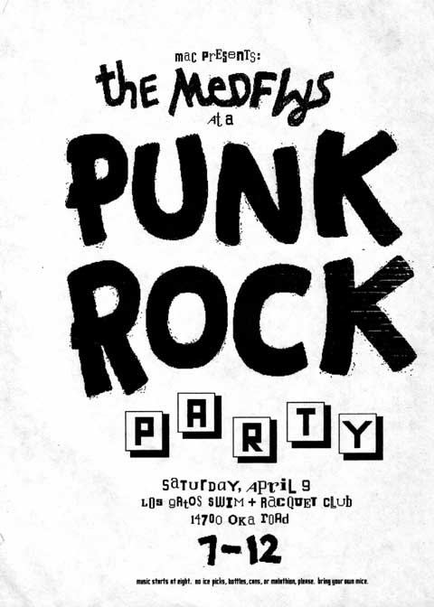

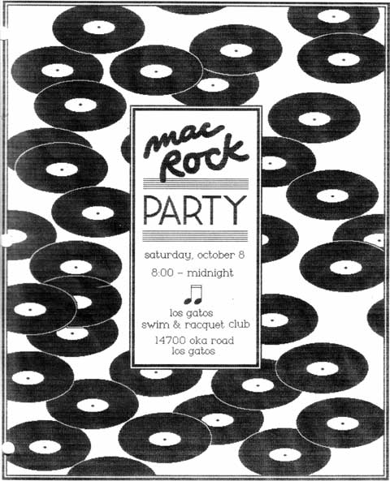

The Mac group worked hard, but we occasionally had parties thrown by Apple for the team, sometimes with unusual themes. The left most poster promoted our "Punk Party", which we were supposed to attend in "punk" attire and featured the local band "The Medflys".  The poster on the right advertised a dance with music supplied by a DJ.  Some of us were so disappointed with the music that he played that we drove to a nearby record store during the party to buy some better music to play there.

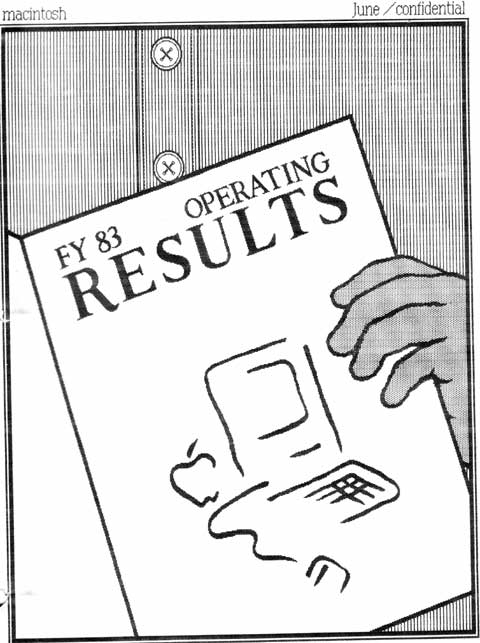

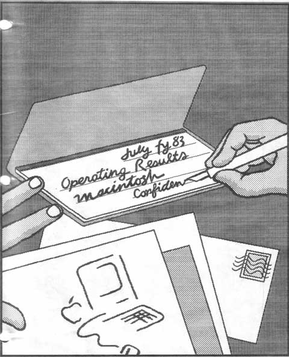

Steve Jobs was very visually oriented, and everyone knew that he reacted more favorably to material presented with nice graphics and high production values.  Susan was recruited by the Finance team to use MacPaint to make attractive covers for the monthly financial reports.  Here are some covers that she made for the June and July 1983 reports.

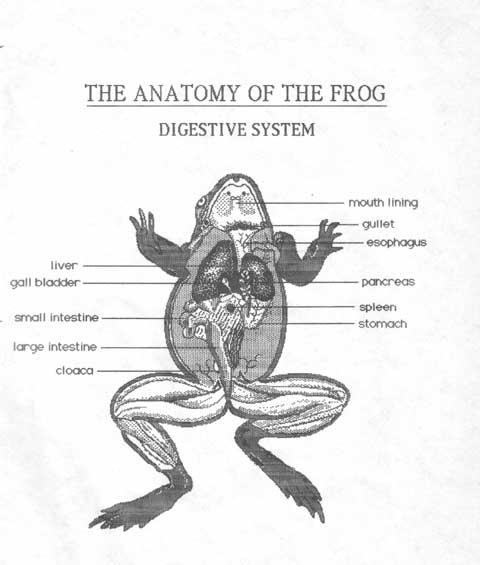

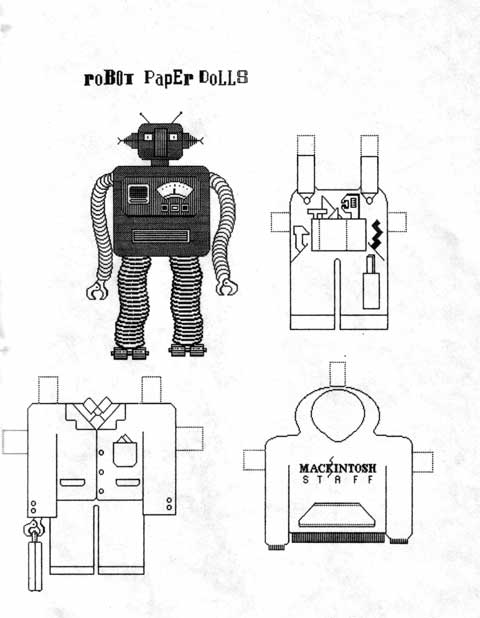

As we began preparing for the launch in the fall of 1983, Susan was requested to produce art for various marketing materials, to show off the kinds of things you could do with MacPaint.    The frog on the left demonstrates how you might use MacPaint in a biology class.  Susan also had a fondness for whimsical applications, as demonstrated by the one on the right.

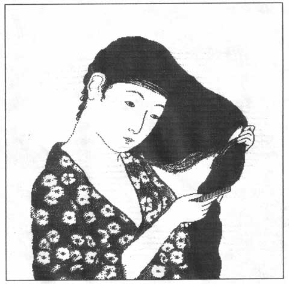

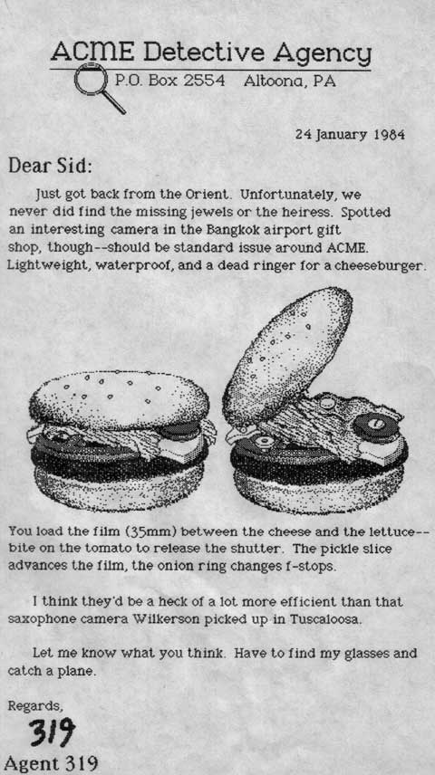

Here are some examples that Susan created for marketing.   The "Japanese Lady" on the left is a pretty famous one, since it was used in the original brochure.   She started with a scan of a fine Japanese woodcut that Steve had procured.    I think the detective agency letter on the right was also used in an advertisement.

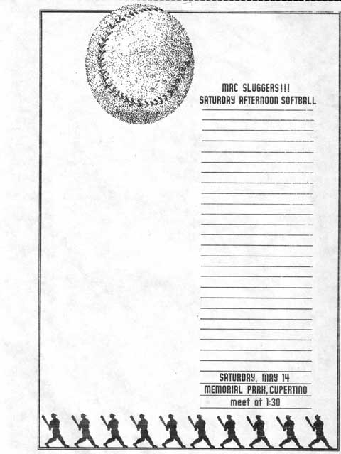

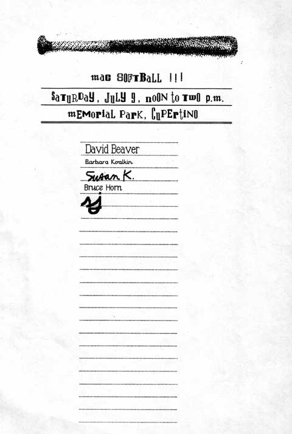

Sports were another outlet to blow off steam between longs hours of working.  In the spring of 1983, we managed to get facilities to install a basketball hoop in the back of Bandley 4, and usually played a half-court game every afternoon.  We also had co-ed softball games once per month, which could sometimes get pretty intense.

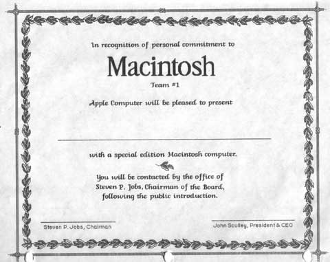

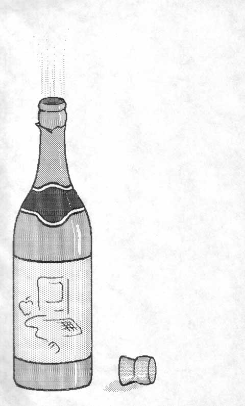

Apple gave out brand new Macintoshes to everyone on the team right after the launch (see The Times They Are A-Changin');  on the left is a certificate that accompanied each machine.  On the right is a bottle of champagne, in honor of the launch, to complete the celebration.