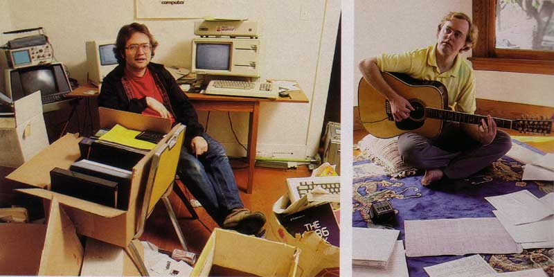
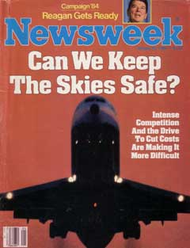

# Can We Keep The Skies Safe?
* Author: Andy Hertzfeld
* Story Date: January 1984
* Topics: The Press, The Launch, Marketing
* Characters: Steve Jobs, Burrell Smith, Regis McKenna, Steve Wozniak, Andy Hertzfeld, Andy Cunningham, Jane Anderson, Katie Cadigan
* Summary: Burrell and I get our pictures in Newsweek

 
    
The marketing campaign that launched the original Macintosh was almost as imaginative and innovative as the product itself. It included a carefully orchestrated press blitz, masterminded by Regis McKenna, the legendary Silicon Valley marketing guru whose business card read "Regis McKenna, Himself", and his team of bright, young female assistants, who we nicknamed the "Rejettes": Andy Cunningham, Jane Anderson and Katie Cadigan.

The basic idea was to create a perception of the Macintosh introduction as an epochal event, by garnering as much attention as we could from every possible venue, coordinated to appear around the time of the introduction at the shareholders meeting.  Some of the monthly magazines had more than three months lead time, so the press briefings and interviews began in October 1983 with Byte Magazine (see The Mythical Man Year), and became more numerous with each passing week.

One of the most sought after goals of the press campaign was to obtain a cover story from either Time or Newsweek during the week of the Macintosh launch. Regis and his team were expert at the delicate dance of courtship that such an endeavor required, since journalistic ethics mandated that the cover could not be bought or promised ahead of time.  In mid-December, after interviewing Steve and some of the design team, we heard that Newsweek was potentially interested in doing a cover story.

It looked promising enough that the Rejettes arranged an impromptu trip to New York City for Steve Jobs to meet the top brass at Newsweek.  Apparently, they were interested in featuring Burrell Smith and myself in the article, too, so we accompanied Steve on a whirlwind three day trip to New York City, staying at Steve's favorite hotel, the Carlyle, which cost over $400 per night.  We got a tour of Newsweek's main offices, demoed the Mac to the editorial staff, and even spent some time chatting with Katharine Graham, the long-time publisher of the Washington Post and Newsweek.

After we returned to Cupertino, we got word that we had passed muster and that Newsweek was enthusiastic about doing a cover story about the Macintosh introduction.  Burrell and I were interviewed again by Newsweek reporter Michael Rogers, who had written a novel called "Silicon Valley" that I read the previous year, and were scheduled to be photographed the following day.

The software still wasn't finished, even though there were only five days left to work on it, and tension mounted as weeks of relentless pressure were taking their toll on the team (see Real Artists Ship).  When the Newsweek photographer arrived, he wanted to photograph me in my office, but I was afraid that would be too disruptive to the rest of the team, so I told him that I often worked at home, and convinced him to take the picture in the messy office of my house in Palo Alto.

Unfortunately, somehow the San Jose Mercury found out that we had been granted the Newsweek cover, and mentioned it in their business gossip column that came out on Friday.  Newsweek didn't want the world to think their cover was pre-determined, so that was enough to make them change it - switching, at the last minute, to a stand-by cover asking the burning question "Can We Keep The Skies Safe?"

But it was still amazing to come into work the day before the introduction, and see the January 30, 1984 issue of Newsweek, opened to a four page story about the Macintosh, which began with separate pictures of Burrell and myself in our respective houses.  Burrell was sitting on the floor playing his beloved 9-string guitar, with engineering diagrams spread out on the rug in front of him.   I was sitting on a chair in the spare bedroom of my house that I used for an office, in its usual state, which was extremely cluttered.

There was a long review of the Macintosh, which was generally positive, although it said that some users may find the graphical user interface to be "visually tiring to use".  Burrell had the best quote in the entire article, which was used to end it.  When asked what he wanted to do next, he responded "I want to build the computer of the 90's.  Only I want to do it tomorrow."

The week following the shareholder's meeting, Steve Jobs and the Mac design team flew to Boston, to recreate the Mac introduction on the East Coast, in front of the Boston Computer Society.  Steve Wozniak also came along, and participated in a panel discussion with the design team following the intro spiel.

Burrell and I sat together in a row of seats near the middle of the plane on the six hour flight to Boston.  We were just settling in for the long flight when a stewardess approached us, holding a copy of Newsweek, open to the page with our pictures.

"I recognized you from your pictures", she told us,  "Can I have your autograph?"

I was flustered, because no one had ever asked me for an autograph before.  I demurred, but eventually Burrell and I both signed our names near our pictures, feeling slightly embarrassed.

I turned on my Walkman, pushed back my seat and tried to relax, hoping to be able to fall asleep, but around twenty minutes later, we were approached by a different stewardess, also holding a copy of the Newsweek issue.  "Are you the guys who designed the Macintosh?", she asked, "I'd love to get your autographs."

Wait a second, I thought to myself, Woz is on this flight.  And sure enough, when I stood up and turned around, Woz was also standing, pointing at us and cracking up.  He had convinced the stewardesses to cooperate in pulling one of his typical pranks on us.  I started laughing too, because it was a pretty good one.