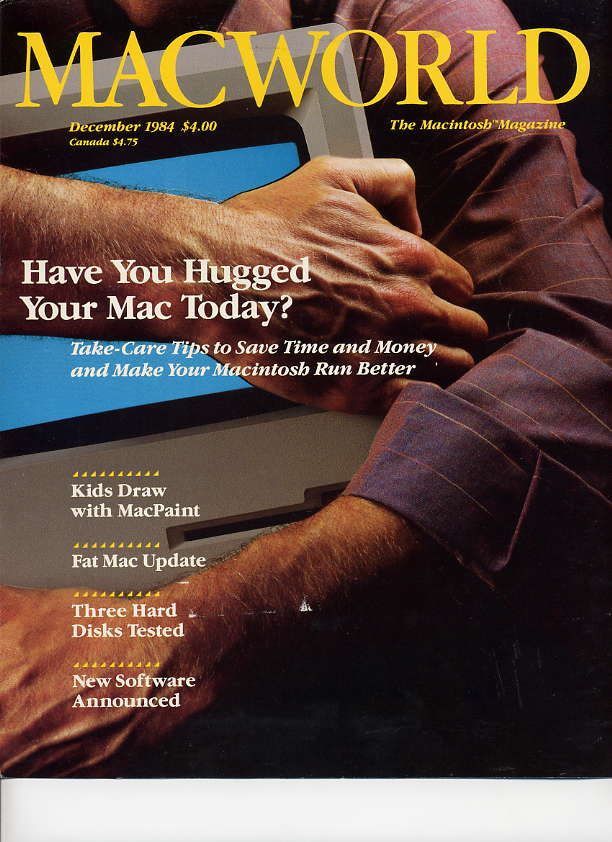

# Where'd That Hand Come From?
* Author: Eric Barnes
* Story Date: April 1984
* Topics: Marketing
* Characters: 
* Summary: How the hand and the mouse came together!

 
    
In the mid '70s, I became San Francisco's first professional male hand model.  That's a whole other story in itself.  But for three or four years, there were no others in the field and I built a nice (and profitable) reputation, shooting hand shots for all manner of products and companies.

Around April, 1984, I got a call from one of my favorite photographers, Dennis Gray, booking me for an hour, asking me to bring a variety of shirt colors, a couple of sports jackets and a suit jacket.

I showed up, a pale blue shirt was chosen, and we began the shoot.  I was simply to hold this weird little plastic thing in a variety of ways.  After about 45 minutes, Dennis thought we had the shot.  I then asked him, "What \*is\* this thing?"  Dennis replied, "Darned if I know, they call it a 'mouse.'"

A year later, I bought my first Mac, a 512.  Unpacking it, I saw that virtually every surface of the boxes, plus all the manuals had this hand on it.  Oddly, I didn't remember the shot amidst all the many I'd done in the meantime.  It only dawned on me a few days later that it was my hand!  

The connection also brought me a variety of hand shots for MacWorld magazine (Dec 84 cover pictured) and I was later told that my hand was the only 'live' thing on MacWorld covers for its first five years of publication.

So though I didn't have anything to do with the creation of the Mac, I did contribute to it's great marketing effort.

The mouse shot, btw, paid me only $100.  I don't suppose Steve would be willing to pay residuals at this late date?