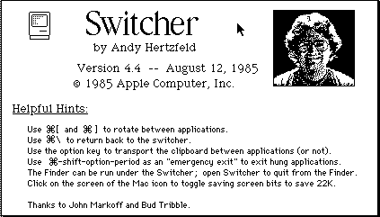
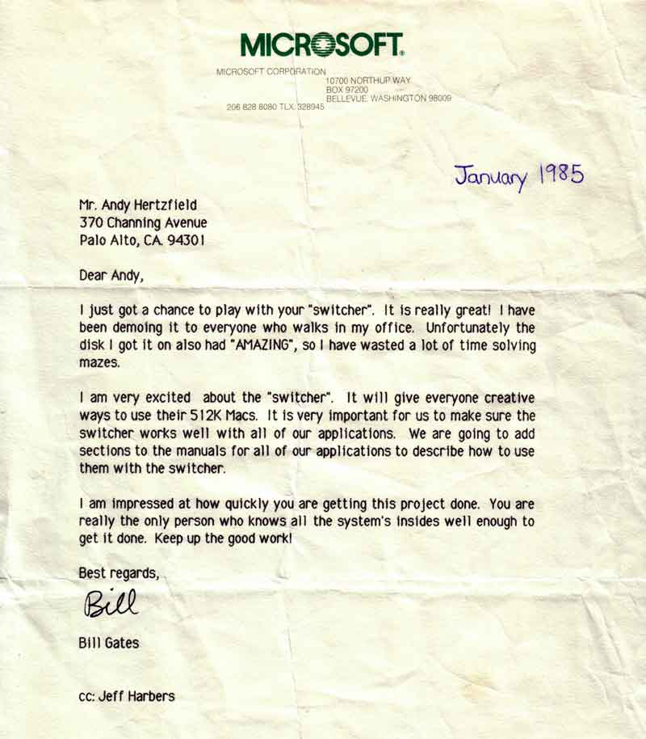

# Switcher
* Author: Andy Hertzfeld
* Story Date: October 1984
* Topics: Software Design, Technical, Compensation
* Characters: Andy Hertzfeld, Neil Konzen, Bill Gates, Bud Tribble, Steve Jobs, Steve Capps, Charles Simonyi, Phil Goldman, Tom Petrie, Victor Bull, John Markoff, Burrell Smith, Guy Kawasaki
* Summary: The Macintosh's first multi-tasking environment

 
    
The first commercial product that I worked on after going on leave of absence from Apple in March 1984 (see Leave Of Absence) was a low cost, high resolution scanner for the Macintosh called Thunderscan, that I created in collaboration with a tiny company named Thunderware (see Thunderscan).  I started working on it in June 1984, and by early October, it was almost complete.

Tom Petrie, one of the two principals at Thunderware (the other was Victor Bull, who I worked with on the Silentype thermal printer, the first project that I did for Apple), arranged a few demos for various computer magazines, to curry favorable reviews to promote the product.  On October 11th, 1984, I drove with Tom to an office in Hillsborough, to demonstrate Thunderscan for Byte magazine.

The Byte reviewer was John Markoff, a technology scribe for the San Francisco Chronicle who was one of the best reporters covering the personal computer industry.  Tom described Thunderscan while I set up the demo and started scanning.  John asked a few questions, taking notes with his IBM PC, which was running a character-based text editor that I viewed with the typical pious disdain of a Macintosh purist.  As I was answering one of his questions, the phone rang.

"Excuse me," he told us, as he pressed a key combination on his keyboard, his monitor screen instantly changing to a different program.  He talked on the phone for a minute or two, occasionally typing, before he finished the conversation and pressed a key combination to switch back to his Thunderscan notes.

"What did you just do?," I asked John, curious about the software that he was running.  "How did you switch to another application so quickly?"

"Oh, I'm running Memory Shift.  Haven't you seen it?" John responded.  "It's a DOS utility program that keeps multiple applications resident in memory, and allows you to switch between them quickly.  I've been using it a lot lately."  John typed the switch command a few times in rapid succession, to show me how fast it could do its thing.

"You know, I think I could do that for the Macintosh", I suddenly blurted out, before I even thought about it consciously. 

The 512K Macintosh, with four times the memory of the original, had just started shipping a few weeks ago.  I had considered trying to run multiple applications simultaneously on the 512K Mac, but I was stymied by low memory conflicts and other potential gotchas.  But now, as I observed Memory Shift in action on John's PC, I suddenly saw a simple way to do it, which didn't seem to be too hard to implement.

"Yeah, that would be cool," John agreed.  I continued with the Thunderscan demo, but it was hard for me to concentrate on it, because I couldn't stop thinking about application switching.  There were a few intricate problems to solve, but it seemed eminently doable, and I thought it would be incredibly useful if I got it to work.

Tom Petrie noticed how excited I was about the new idea and, as he drove me home from the demo, he reminded me of my prior commitments, and made me promise that I would finish the alpha release of Thunderscan as soon as possible, before daring to start something new.  We agreed on a list of a dozen or so tasks, which I thought I could accomplish within two weeks.  Once the alpha release was completed, I could take a short hiatus, in order to work on application switching, before diving back into Thunderscan to finish the 1.0 release, due by the end of November.

During the next two weeks, I focused on polishing Thunderscan to get it ready for the alpha release, but I also spent idle moments pondering the design of the application switcher.  One fundamental decision was whether or not to load all of the applications into a single heap, which would make optimal use of memory by minimizing fragmentation, or to allocate separate "heap zones" for each application.  I decided to opt for separate heap zones to better isolate the applications, but I wasn't sure that was right.

There were lots of little problems to solve.  The most crucial one was that the system software kept lots of application-specific global variables in low memory (see Mea Culpa), which needed to be swapped during context switching, so each application could maintain its own set of them.  The hard part was coming up with the precise list of exactly what needed to be swapped; many of the variables were obvious, but some were quite subtle, and dependent on how applications were using them.  I knew that my first cut wouldn't be perfect, but I was confident that I could debug the inevitable problems once I saw how the applications were actually failing.

A few days after starting the push to finish Thunderscan, I received an intriguing phone call from Jeff Harbers, the manager of Microsoft's Macintosh applications team.  Jeff told me that Microsoft had a very strategic project that they needed for the Macintosh, and that they thought that I was the ideal person to implement it.  He wouldn't tell me anything else over the phone, but he offered to fly me up to Seattle to discuss it in person.  Even though I was right in the middle of trying to complete Thunderscan, I was intrigued enough to accept his offer to fly up to Seattle and visit with him the following Tuesday.

Jeff picked me up at the airport, and we drove to Microsoft's main building where we were joined by Neil Konzen, a talented 23 year old who was Microsoft's main systems programmer on the Macintosh.  I knew Neil from his days as an early Apple II hobbyist, when we collaborated on adding features to an assembly language development system when he was only 16.

Jeff asked me what I was working on, and I told him about Thunderscan, which he seemed to be interested in.  But when I mentioned that I was about to start some experiments with an application switching utility, his jaw dropped, and he looked like he couldn't believe what I said.

"That's just what we wanted to talk with you about!", he exclaimed, "It's great that you're already working on it".

Jeff explained that Microsoft had put a lot of effort into getting their applications to run well in the tiny space available in the 128K Macintosh, which they considered to be a key competitive advantage.  But as things stood, the 512K Mac would undermine their efforts, since it allowed applications to be much larger.  Plus, Lotus had recently announced an integrated application suite for the 512K Macintosh called Jazz that made it easy to quickly switch between different functional areas.   But if the Macintosh could run multiple applications simultaneously, the small memory footprint of the Microsoft apps would continue to be advantageous, since their lower memory requirements meant that more of them could run concurrently, and users could put together customized application suites on their own.  The purpose of the visit was to convince me to write an applications switcher under contract to Microsoft.

Neil Konzen had contemplated a potential design, which he conveyed to me in front of a whiteboard.  He decided to use the single heap approach that I had rejected, along with a few interesting twists to minimize memory fragmentation.  I told him about the alternate approach of using separate heapzones, and how I thought that it was probably worth it to trade some memory fragmentation for greater robustness.  I told him that I would give his approach some more thought.

Finally, my afternoon at Microsoft culminated in a private meeting with their CEO, Bill Gates.  Jeff ushered me into Bill's office and reviewed the afternoon's discussions for him, before excusing himself to leave us alone to negotiate a development deal.  I had met Bill a few times during the course of Macintosh development, and while I respected his understanding of technology, I was wary of his burgeoning reputation as a conniving businessman.

After exchanging a few pleasantries, and telling me how much the Macintosh mattered to Microsoft, he looked me in the eye and said, "You're a really good programmer, right?  I think you must be a really good programmer."

"I guess so," I responded, not understanding why he was attempting to flatter me.

"Well, I think you are. How long do you think it will take to do this project?  A month or two?  I think a really good programmer like you could get it done in less than two months."

"I really have no idea," I replied, "I'm not far enough along to know if it's even feasible yet."

"Well, let's figure it out," he said in a slightly condescending tone.  "I don't think it could be more than 10,000 lines of code, and a really good programmer like you should be able to write at least a thousand lines of code per week, so I think it will take you less than 10 weeks to write it, if you're as good as I think you are."

I didn't know how to respond, so I kept quiet and let him continue.

"And how much do you think a really good programmer should get paid? Around here we pay our best programmers around two thousand dollars per week. Do you think you should be paid more than that?"

"I don't know," I replied.  I was finally beginning to see where he was coming from.  Bill was trying to get me to brag that I could write the application switcher really quickly, so he could justify paying me a lower price for it.

"Well, I don't think that you could expect to get more than four thousand dollars per week, tops.  Actually, I think that's too much, but let's go with that.  If it takes ten weeks, and you get paid four thousand dollars per week, that means you should get paid $40,000 for writing it."

$40,000 didn't sound like very much to me, especially if it was as strategic to Microsoft as it seemed to be. I think Bill was expecting me to make a counteroffer, but I wasn't very enthusiastic about selling it to Microsoft regardless of compensation, since it really should eventually be part of the Mac OS.

"Listen, I really want to write this, completely independently from you guys, so you won't have to pay me anything to do it.  I certainly don't want to negotiate a deal until I see how it turns out; there might be a show-stopper and I won't be able to get it to work at all. And if I pull it off, it really should be bundled with every 512K Macintosh."

Bill shifted his tactics.  "OK, I don't really care if Microsoft owns it as long as it's available to our users.  I want you to commit that you'll apply your best efforts to making sure that it runs well with our applications, and that you'll call Jeff if you run into any snags.  We can talk again about publishing it later if you want to after you're further along.  How does that sound?"

I told him that sounded good, and I promised to do my best to make it work great with Microsoft's applications, which I wanted to do anyway, since the Microsoft apps were important to most users.  We shook hands and I departed on a positive note.

By the time I returned to my house in Palo Alto that evening, I was burning with the desire to see if I could get something going quickly.  Even though still I had a few more days of work to complete the Thunderscan alpha release, I decided to see if I could write a proof of concept prototype of the application switcher first.

I would eventually have to write a user interface for selecting applications, but the proof of concept didn't have to worry about that; it was hardwired to run MacPaint, MacWrite, MacDraw and the Finder.  I worked for 20 hours straight writing the core of the program, which worked by patching traps to extend a few essential system calls, like GetNextEvent, Launch and ExitToShell.  The hardest part was going through all of the low memory locations, determining what needed to be swapped.  It was incredibly satisfying to see it begin to work, crashing all the time at first, but gradually stabilizing as I tracked down various problems.

I had it working for an hour or so when I saw Bud Tribble return home.  Bud had finally finished his M.D./Ph.D. program at the University of Washington, including interning for a year, but he decided that working on the Macintosh was more fun than being a doctor, so he had returned to Apple in his old job as software manager a few months earlier, in July 1984.  Bud was living at Burrell Smith's house, which was next door to mine.

I dragged Bud over to my house to show him how I could rapidly switch between MacPaint, MacWrite and MacDraw.  He was impressed, but to my surprise he complained that the switching, which was almost instantaneous, was actually too fast.  

"I think it might be confusing to switch from one application to another without any feedback," he told me.  "What if someone switches accidentally?  Maybe you could use animation to make a smoother transition."

That sounded like a great idea to me. We decided that one application should scroll off the screen horizontally while another was scrolling on, which gave the users a simple, concrete mental model of the applications wrapped around a sort of Lazy Susan, which they could rotate to move the desired application to the visible area.  I quickly wrote some fast scrolling routines, and was blown away by how cool it looked to see the applications zip across the screen.

I started showing my proof of concept demo to my friends at Apple, as well as a few user group demos, and it was very positively received.  Unfortunately, I still had to finish up the product release of Thunderscan, which I barely managed to do by the end of November as I had promised.   After taking a short vacation, I got back to work on what I was now calling "Switcher" in early December and by Christmas I had much of it implemented, including a simple UI for selecting applications and "Switcher Documents" for remembering sets of related applications.

In early January 1985, I got a phone call from Guy Kawasaki, one of Apple's third party evangelists, who told me that Apple was interested in buying Switcher, and that he was assigned to make that happen.  The first step was arranging a demo for Steve Jobs.

I entered Steve's office with a bit of trepidation, because I thought that Switcher was worth at least a quarter of a million dollars to Apple, but I was sure that Steve would never want to pay me that much.  But I was also proud of Switcher, and was interested in seeing how Steve would react to it.

I booted up my by now standard demo of MacWrite, MacPaint, MacDraw and the Finder, as well as a little maze generating program written by Steve Capps.  I configured Switcher with the scrolling animation initially turned off, so it would have more impact when I showed it later.  I demoed cutting and pasting between MacWrite, MacPaint and MacDraw, in seconds instead of minutes, and then I turned on the scrolling animation, and starting switching rapidly between them, in both directions.

"OK, I've seen enough, " Steve interrupted me.  "It's great.  Apple is going to bundle it with the Mac.  Congratulations."

But then he paused, and stared at me for a moment with an incredibly intense gaze, as if he was sizing me up or maybe just trying to scare me.

"But I don't want you taking advantage of this situation.  I'm not going to allow you to take advantage of Apple."

"What do you mean?" I asked him, genuinely puzzled.

"There's no way that you could have written that program without confidential information that you learned by working at Apple.  You don't have the right to charge whatever you like for it."

I started to get angry. "The program is only half finished, and if I don't think you're paying me fairly, I won't be motivated to finish it."

Steve gave me another intense stare as he paused for a few seconds.  Then he stated a single number, without explanation.

"One hundred thousand dollars."

"I don't know," I told him, "I think it's probably worth a lot more than that."

"Don't argue with me.  $100,000 is fair, and you know it."

I didn't seem to have any alternative but to capitulate to Steve's price setting, since he's difficult to argue with and I really wanted Switcher bundled with the Mac.  I eventually negotiated the final agreement with Guy Kawasaki, where, in addition to the $100,000, I managed to get a 10% royalty of the wholesale price if Apple sold Switcher separately, which Steve swore they would never do, but eventually the royalty delivered another $50,000.

Getting Switcher going wasn't that hard, but it was a very difficult program to finish, because it overturned some of the underlying assumptions that applications were making, yet it was committed to keeping everything working anyway.  Much of the work in the latter stages involved testing it with every application that I could get my hands on and debugging crashes.  Usually I could concoct some kind of technique that would mitigate the problem without causing worse problems elsewhere.

Predictably, the hardest part of finishing Switcher was making it work smoothly with the Microsoft applications.  That was partially because Microsoft was a very early developer, and took liberties with the system that most developers would shy away from, but it was mostly because the instructions comprising their applications were encoded in pseudo-code to save space, in the tradition of the byte-code interpreters from Xerox, which Charles Simonyi advocated.

Unfortunately, the pseudo-code kept me from disassembling the program when it crashed, which made it more difficult to debug.  I finally developed a debugging technique by single stepping through their interpreter, six instructions at a time to get to the instructions that were doing the work,  but it was pretty painful.  I was determined to slog through it because of the promise that I made when I visited Microsoft.

One of the last problems that I addressed before finishing the first release of Switcher in March 1985 had to do with applications hanging.  If you're running multiple applications, you don't want one application hanging to take down all of them.   I added a feature that allowed the user to kill the current application if it was hung up, by monitoring for a specific key combination during the vertical blanking interrupt handler.

I knew that I had to pick a very rare key combination, because you didn't want users killing their applications accidentally.  I decided on shift-command-option-period, four keys held down at once, which I thought would be pretty hard to stumble into accidentally.   But I was surprised when I got a call from Jeff Harbers at Microsoft.

"Hey, I like that abort feature that you just added, but you're going to have to change the key combination, because we're using that in Microsoft Word.", Jeff told me.  Microsoft Word was very complex, and it possessed an enormous range of keyboard shortcuts, way too many, as far as I was concerned.

"OK, suggest something for me to change it to and I'll consider it," I told Jeff.

Jeff didn't have anything specific in mind, so he told me that he would get back to me soon.  I had to laugh when he called me back the next day, and told me that he wanted to withdraw his request and that I should keep shift-command-option-period as the abort sequence.

"OK, that sounds good to me, " I told him.  "But why the change?  Doesn't it still conflict with Word?"

"We'll change Word in the next release not to use it.  The problem was that we couldn't find a safe sequence - I guess we're already using every key combination!"

I officially released the finished version of Switcher in April 1985, and I maintained it for a few versions after that.  Eventually, I handed it off to Phil Goldman, a tremendous young programmer from Princeton who was recently hired at Apple, who went on to write MultiFinder (with Erich Ringewald), Switcher's eventual successor, in 1987.