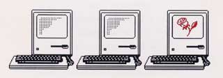
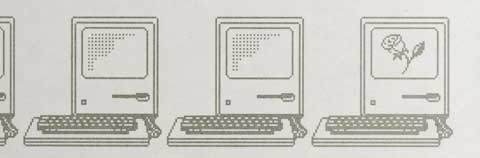

# A Rose by Any Other Name
* Author: Caroline Rose
* Story Date: December 1985
* Topics: Documentation, Credit
* Characters: Caroline Rose, Bob Anders, Brad Hacker, Dan Cochran, Louella Pizzuti
* Summary: The Easter egg in Inside Macintosh

When the Inside Macintosh developer documentation was finally published, it reflected years of work I'd done along with Bob Anders, Brad Hacker, and a few others. i'd guided the style of it, written most of it, and edited all of it. More recently, I'd supervised a nutty, charming young woman named Louella Pizzuti who was hired to convert the files from the Apple III over to the Macintosh. (Nearly six years later, she hired me to take over *develop*, Apple's technical journal, but that's another story.) Suffice it to say my life had been consumed by Inside Mac for three and a half years.

The product manager, Dan Cochran, oversaw Inside Mac through its production into print. He faced some difficult decisions regarding how to publish the first edition, and eventually it was decided that, in addition to separate softcover editions of Volumes I through III, the three volumes would be combined into one huge hardcover edition. (We jokingly referred to it as a coffee table book: big enough to use as a coffee table.) A combined preliminary "phone book" edition on flimsy paper had already been distributed, but I was of course eager to see the final printed version.

The hardcover edition was actually in hand by the end of November 1985 - but not in my hands: I was told I couldn't see it until a celebratory event that was scheduled for December 4. People at Apple aren't usually big on formalities, but I could understand wanting to make a ceremony of this occasion. I was delighted to see that one of the three pixelated Mac images on the printed invitation to the event showed a red rose on its screen. I was often called "C. Rose" by others on the team, and I made no secret of how much I liked (and identified with) that flower. Seeing the rose on the invitation brought a big smile to my face.

 

The event started with a few words about the Inside Mac effort, followed by a presentation to team members of crystal bookend-like plaques etched with an image of the Mac (the same as on the invitation, sans the rose) and a personal inscription. But the highlight of the ceremony for me was being handed the hardcover edition itself. Everyone else seemed all atwitter over this, I figured because they knew what a highly anticipated moment it was for me.

Upon opening the book, I saw that a row of Macs like the one on the plaque had been printed on the reverse of the front cover, all along the bottom, as well as on both sides of a stiff sheet inserted before the title page. As I began to thumb through the book, the others around me seemed impatient, and finally asked me to turn to the inside of the back cover; not surprisingly, the now-familiar row of Macs appeared there and on the sheet inserted before it. Then they asked me to lift up the dust jacket so I could see the last couple of Macs in the row, and that was when I saw it: a rose in the last Mac. Seeing *that* rose brought tears to my eyes, and made it a day - and a tribute - I would always remember. (I also received a small rhododendron bush from Dan, which is now flourishing in front of my house, so every Spring I have real flowers as an additional reminder.)

