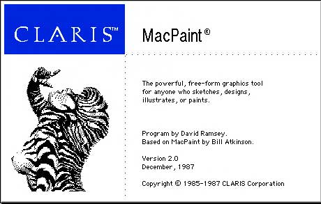

# Evolution Of A Classic
* Author: David Ramsey
* Story Date: March 1986
* Topics: Maintenance, MacPaint
* Characters: Bill Atkinson, Gene Pope, David Ramsey, Rich Page
* Summary: MacPaint 2.0

 
    
I was hired at Apple in early 1986. Oddly, I was given nothing to do when I started, so after setting up my cube and getting my Lisa (all Mac programming was done on the Lisa back then) running, I wandered over to my manager's cube and asked if he had the source to MacPaint. He had-- he handed me a single Lisa diskette with all of MacPaint on it.

MacPaint was the first Mac program I'd ever seen; Bill Atkinson was demonstrating it at Computers Plus, a local Apple store run by Mark Wozniak and Dick Applebaum. I was completely awestruck at how fast the computer could "sling bits" on the screen. But there were still things I wanted to change: I wanted to be able to move and resize the image window, for example.

After a week or so of playing around I showed my manager (Gene Pope) what I'd done. I had just been killing time, since nobody had told me to do anything, but Gene asked me to add more features with an eye towards a "MacPaint 2.0".

## And so it begins

At first I was nervous: Bill Atkinson is a hard act to follow, and I was also worried what he might think about some newbie hire taking over his baby. But he was tremendously supportive (and it probably also helped that he was deeply involved with his new project, Hypercard) and even took hours of time to go over his hand-optimized 68000 assembly language routines to explain how they worked. I still remember him peering intently at me, making sure I understood the importance of what he was saying: "Unroll the loops", "keep the registers full"...

The day I finally figured out how "regions" in QuickDraw worked was an epiphany, really. 

## Specs? We don't need no steenking specs!

It seems strange by modern standards, but MacPaint 2.0 never had a product spec. There was no marketing requirements document. There were no design meetings. There wasn't even a product manager until the last few months of work. Many people had opinions and suggestions (and the then-new tear-off menus came directly from HyperCard, courtesy of Bill) but ultimately the product was what *I* wanted it to be. 

Of course, I had more leeway than Bill did with the original MacPaint since I didn't have to worry about running on a 128K Mac-- a 512K computer was the minimum. Thus MacPaint gained a sizeable, movable painting window; multiple document support; large clipboards, the "snapshot" capability with the "magic eraser", and so forth.

Some features were pretty subtle: for example, in response to a request from Radius, MacPaint 2.0 would automatically move its window down if the user took advantage of a Radius monitor's capability to enlarge the standard menu bar!

## Fun hardware note

Most of MacPaint was developed on a "Big Mac" prototype-- a computer that was a design study for the next Macintosh. Basically it was a 16mHz 68020 version of a Mac Plus. Cases were never made, so it was simply a 1 foot square circuit board mounted on a piece of wood, connected to a 10 megabyte SCSI hard drive.

I used the Big Mac prototype since it was faster and more reliable than the Macintosh II prototypes available. It was never produced, and designer Rich Page left Apple to work at NeXT shortly after his design "lost" to the slotted Mac II.

I still have the Big Mac I used at Apple. I wonder if it still works.

## The Zebra Lady

Test versions of MacPaint had different images, generally from comic books, in the "About" box. The last beta version showed the nude upper torso of a zebra-striped woman taken from the Olivia de Berardinis painting "Zebra Lady". With the covert approval of all involved, this version made it into the release: you could show the Zebra Lady image by holding down the tab and space keys while selecting "About MacPaint". 

When the artist found out, she took it well. I have a signed copy of the original print framed to this day.

## Shelf Life

MacPaint 2.0 was introduced in late 1987 (did it really take me that long to write?) and remained on the market until fall 1998. I think this is  a record of some sort for personal computer software.