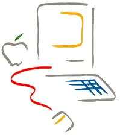

# The Macintosh Spirit
* Author: Andy Hertzfeld
* Story Date: undated
* Topics: Apple Spirit, , Inspiration, Management, Personality, Origins, Reality Distortion
* Characters: Steve Jobs, John Couch, Jef Raskin, Burrell Smith
* Summary: The attitudes and values of the team forged the spirit of the Macintosh

 

    
The original Macintosh was designed by a small team that worked long hours with a passionate, almost messianic fervor, inculcated by our leader, Steve Jobs, and the excitement that we felt during its creation shines through in the finished product.  The attitudes, values and personalities of the designers are reflected in the thousands of subtle choices that they make in the course of their design, coalescing into a spirit or feeling imparted to its users.

   We were excited because we thought we had a chance to do something extraordinary.  Most technology development is incremental, but every once in a while there's an opportunity to make a quantum leap to a whole new level.  A few years earlier, the Apple II and other pioneering systems made computing affordable to individuals, but they were still much too hard for most people to use.  We felt that the Mac's graphical user interface had the potential to make computing enjoyable to non-technical users for the very first time, potentially improving the lives of millions of users.

   As soon as he seized the reins from Jef Raskin in January 1981, Steve Jobs galvanized the Macintosh team with an extreme sense of urgency.  One of his first acts as head of the project was to bet John Couch, the executive in charge of the Lisa Division, $5000 that the Macintosh would beat the Lisa to market, despite the fact that Lisa had more than a two year head start, and we had barely begun.  The Mac team always had incredibly optimistic schedules, because Steve would never be satisfied with more realistic estimates (see Reality Distortion Field), as if he could make it happen faster through sheer force of will.

  But the desire to ship quickly was counterbalanced by a demanding, comprehensive perfectionism.  Most commercial projects are driven by commercial values, where the goal is to maximize profits by outperforming your competition.  In contrast, the Macintosh was driven more by artistic values, oblivious to competition, where the goal was to be transcendently brilliant and insanely great.  We wanted the Macintosh to be a technical and artistic tour-de-force that pushed the state of the art in every conceivable dimension.  No detail was too small to matter (see PC Board Esthetics), and good enough wasn't good enough - if Steve could perceive it, it had to be great.

  Steve encouraged the Mac designers to think of ourselves as artists.  In the spring of 1982, he took the entire Mac team on a field trip to a Louis Comfort Tiffany exhibition in San Francisco, because Tiffany was an artist who was able to mass produce his work, as we aspired to do.  Steve even had us individually sign the interior of the Macintosh case, like artists signing their work (see Signing Party), encouraging each one of us to feel personally responsible for the quality of the product.

   Other groups at Apple had an elaborate formal product development process, mandating lengthy product requirement documents and engineering specifications before implementation commenced.  In contrast, the Mac team favored a more creative, flexible, incremental approach of successively refining prototypes.  Burrell Smith developed a unique hardware design style based on programmable array logic chips (PAL chips), which enabled him to make changes much faster than traditional techniques allowed, almost with the fluidity of software.  Instead of arguing about new software ideas, we actually tried them out by writing quick prototypes, keeping the ideas that worked best and discarding the others (see Busy Being Born).  We always had something running that represented our best thinking at the time.

  You might think that impossible schedules and uncompromising perfectionism would lead to an oppressive work environment, but most of the time, the ambiance of the Mac team was spontaneous, enthusiastic and irreverent.  Jef Raskin had a playful management style, encouraging a workplace teeming with toys and semi-organized games (see Good Earth), which carried over to the Jobs era.  Most of the early team members were around the same age, in our mid-twenties, and we enjoyed each other's company.  We increasingly hung out together as the project demanded ever greater chunks of our time, abandoning the distinction between work and play.  Despite the incessant pressure, we loved what we were doing.

   Given Steve's autocratic tendencies, the Mac team was surprisingly egalitarian.  Unlike other parts of Apple, which were becoming more conservative and bureaucratic as the company grew, the early Mac team was organized more like a start-up company.  We eschewed formal structure and hierarchy, in favor of a flat meritocracy with minimal managerial oversight, like the band of revolutionaries we aspired to be.  Steve Jobs would sometimes issue an unreasonable edict or veto something that everyone else wanted, but at least he would relent when he saw he was wrong (see Quick, Hide In This Closet!).  At our third retreat in January 1983, Steve reinforced our rebel spirit, which was waning as the team grew larger, by telling us "it's better to be a pirate than join the navy" (see Pirate Flag).

  Enthusiasm is contagious, and a product that is fun to create is much more likely to be fun to use.   The urgency, ambition, passion for excellence, artistic pride and irreverent humor of the original Macintosh team infused the product and energized a generation of developers and customers with the Macintosh spirit, which continues to inspire more than twenty years later.

